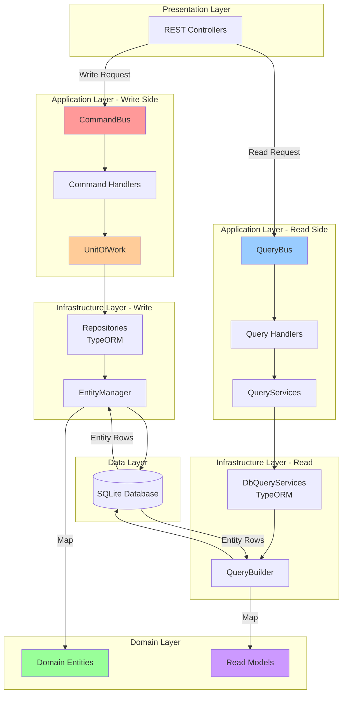
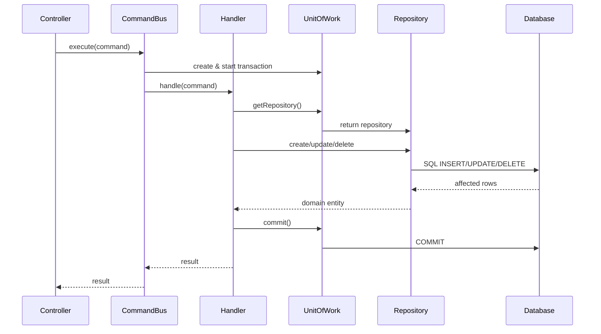
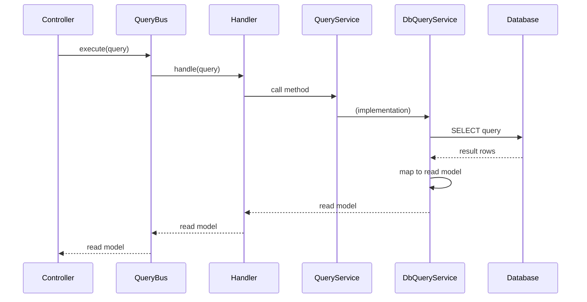
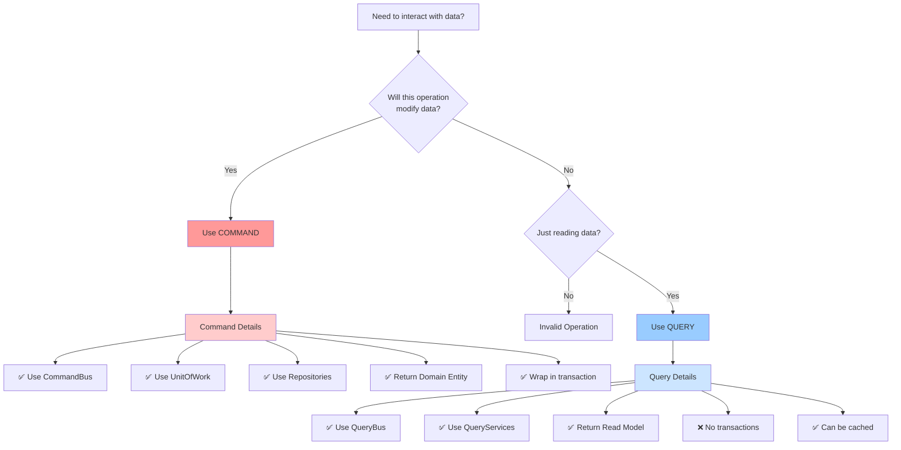
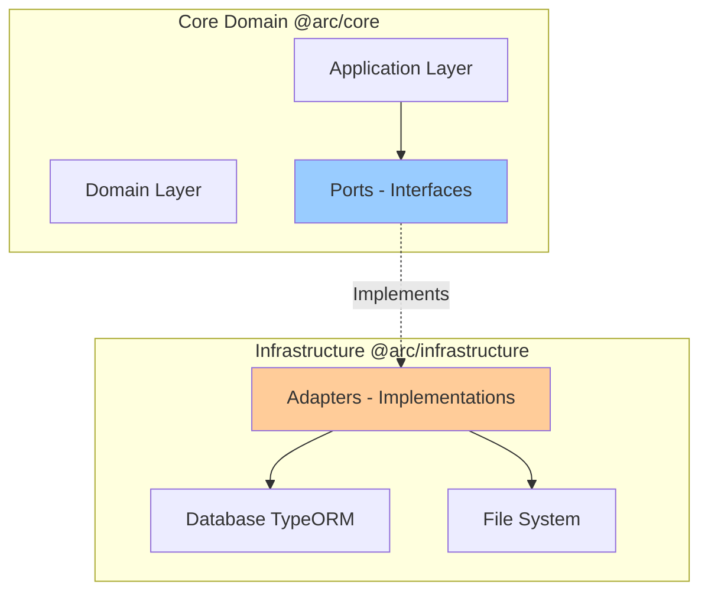

<!--
Copyright (c) Qualcomm Technologies, Inc. and/or its subsidiaries.
SPDX-License-Identifier: BSD-3-Clause
-->

# CQRS Architecture Overview

## Document Information
- **Version**: 1.0
- **Date**: March 17, 2026
- **Status**: Active Reference
- **Audience**: All Developers, Architects
- **Related**: [Query Guidelines](./cqrs-query-guidelines.md) | [Command Guidelines](./cqrs-command-guidelines.md)

---

## Table of Contents
1. [What is CQRS?](#1-what-is-cqrs)
2. [Why CQRS in AudioReach Creator?](#2-why-cqrs-in-audioreach-creator)
3. [Complete Architecture](#3-complete-architecture)
4. [Command Side (Write Operations)](#4-command-side-write-operations)
5. [Query Side (Read Operations)](#5-query-side-read-operations)
6. [Command vs Query Comparison](#6-command-vs-query-comparison)
7. [Decision Tree](#7-decision-tree-when-to-use-what)
8. [Port-Adapter Architecture](#8-port-adapter-hexagonal-architecture)
9. [Key Principles](#9-key-principles)
10. [Benefits](#10-benefits)

---

## 1) What is CQRS?

**CQRS (Command Query Responsibility Segregation)** is an architectural pattern that separates read operations (queries) from write operations (commands).

### Core Concept

```
Traditional Approach:
┌─────────────┐
│   Service   │ ← Handles both reads and writes
│  (Mixed)    │ ← Same models for read and write
└─────────────┘

CQRS Approach:
┌─────────────┐     ┌─────────────┐
│  Commands   │     │   Queries   │
│  (Writes)   │     │   (Reads)   │
│             │     │             │
│ - Modify    │     │ - Retrieve  │
│ - Validate  │     │ - Optimize  │
│ - Events    │     │ - No side   │
│             │     │   effects   │
└─────────────┘     └─────────────┘
```

### Key Distinction

- **Commands**: Change state, return minimal data (often just success/ID)
- **Queries**: Read state, return optimized data, never modify state

---

## 2) Why CQRS in AudioReach Creator?

### Business Requirements

1. **Complex Read Requirements**
   - Different views need different data shapes
   - Performance optimization for specific queries
   - Aggregations and statistics

2. **Transactional Integrity**
   - File uploads require ACID transactions
   - Bulk operations need rollback capability
   - Data consistency is critical

3. **Scalability**
   - Read operations can be optimized independently
   - Write operations can be isolated and controlled
   - Future: Separate read/write databases if needed

4. **Maintainability**
   - Clear separation of concerns
   - Easier to test and debug
   - Explicit data flow

---

## 3) Complete Architecture

### High-Level Overview



### Detailed Architecture

```mermaid
graph TB
    subgraph "Write Side - Commands"
        direction TB
        RC1[REST Controller<br/>POST/PUT/DELETE]
        CMD[Command Object]
        CB[CommandBus]
        CH[Command Handler]
        UOW[UnitOfWork<br/>Transaction Manager]
        REPO_INT[Repository Interface<br/>@arc/core]
        REPO_IMPL[TypeOrmRepository<br/>@arc/infrastructure]
        EM[TypeORM EntityManager]
        DB1[(Database)]
        MAPPER1[Mappers<br/>Bidirectional<br/>Domain ↔ DB]
        DE[Domain Entities<br/>Rich Behavior]

        RC1 -->|Create| CMD
        CMD --> CB
        CB -->|Dispatch| CH
        CH -->|Start Transaction| UOW
        UOW -->|Get Repository| REPO_INT
        REPO_INT -.->|Implements| REPO_IMPL
        REPO_IMPL -->|Use| EM
        EM -->|Insert/Update/Delete| DB1
        DB1 -->|Return Rows| EM
        EM -->|Transform| MAPPER1
        MAPPER1 -->|Create| DE
        DE -->|Return| CH
        CH -->|Commit| UOW
    end

    subgraph "Read Side - Queries"
        direction TB
        RC2[REST Controller<br/>GET]
        QRY[Query Object]
        QB[QueryBus]
        QH[Query Handler]
        QS_INT[QueryService Interface<br/>@arc/core]
        QS_IMPL[DbQueryService<br/>@arc/infrastructure]
        QBL[TypeORM QueryBuilder]
        DB2[(Database)]
        MAPPER2[Mappers<br/>Unidirectional<br/>DB → Read Model]
        RM[Read Models<br/>Optimized for View]

        RC2 -->|Create| QRY
        QRY --> QB
        QB -->|Dispatch| QH
        QH -->|Call| QS_INT
        QS_INT -.->|Implements| QS_IMPL
        QS_IMPL -->|Use| QBL
        QBL -->|SELECT Query| DB2
        DB2 -->|Return Rows| QBL
        QBL -->|Transform| MAPPER2
        MAPPER2 -->|Create| RM
        RM -->|Return| QH
    end

    style CB fill:#ff9999
    style QB fill:#99ccff
    style UOW fill:#ffcc99
    style DE fill:#99ff99
    style RM fill:#cc99ff
```

---

## 4) Command Side (Write Operations)

### Purpose
Modify application state with transactional integrity.

### Flow Diagram



### Key Components

1. **CommandBus**
   - Creates UnitOfWork with transaction
   - Dispatches to appropriate handler
   - Manages transaction lifecycle
   - Handles rollback on errors

2. **Command Handler**
   - Orchestrates business logic
   - Uses UnitOfWork to access repositories
   - Controls transaction boundaries
   - Returns domain entities or simple results

3. **UnitOfWork**
   - Manages database transactions
   - Provides repository access
   - Ensures ACID properties
   - Shared QueryRunner for entire command

4. **Repositories**
   - Interface in core (port)
   - Implementation in infrastructure (adapter)
   - CRUD operations on domain entities
   - Bidirectional mapping (Domain ↔ DB)

### Example: Create Project Command

```typescript
// 1. Command
class CreateProjectCommand extends BaseCommand {
  constructor(
    public readonly name: string,
    public readonly description: string,
    clientId: string
  ) {
    super(clientId);
  }
}

// 2. Handler
class CreateProjectHandler {
  constructor(private uow: UnitOfWork) {}

  async handle(cmd: CreateProjectCommand): Promise<Project> {
    await this.uow.startTransaction();
    try {
      const repo = this.uow.getProjectRepository();
      const project = await repo.create(
        new Project(0, cmd.name, cmd.description)
      );
      await this.uow.commit();
      return project;
    } catch (error) {
      await this.uow.rollback();
      throw error;
    }
  }
}
```

**For detailed command guidelines, see [Command Guidelines](./cqrs-command-guidelines.md)**

---

## 5) Query Side (Read Operations)

### Purpose
Retrieve data optimized for specific views without side effects.

### Flow Diagram



### Key Components

1. **QueryBus**
   - Dispatches to appropriate handler
   - No transaction management (read-only)
   - Simple execution pipeline

2. **Query Handler**
   - Orchestrates query service calls
   - Minimal logic (delegation)
   - Returns read models

3. **QueryServices**
   - Interface in core (port)
   - Implementation in infrastructure (adapter)
   - Encapsulates data access logic
   - Returns read models

4. **Read Models**
   - Optimized for presentation
   - No business logic
   - Immutable (readonly properties)
   - 3-tier hierarchy (Summary, Standard, Detail)

### Example: Get All Projects Query

```typescript
// 1. Query
class GetAllProjectsQuery extends BaseQuery {
  constructor(clientId: string) {
    super(clientId);
  }
}

// 2. Handler
class GetAllProjectsHandler {
  constructor(private queryServices: QueryServices) {}

  async handle(query: GetAllProjectsQuery): Promise<ProjectReadModel[]> {
    return await this.queryServices.projectQueryService.getAllProjects();
  }
}

// 3. QueryService Implementation
class DbProjectQueryService implements ProjectQueryService {
  constructor(private dataSource: DataSource) {}

  async getAllProjects(): Promise<ProjectReadModel[]> {
    const projects = await this.dataSource
      .getRepository('Project')
      .createQueryBuilder('p')
      .getMany();

    return projects.map(row => this.mapToReadModel(row));
  }
}
```

**For detailed query guidelines, see [Query Guidelines](./cqrs-query-guidelines.md)**

---

## 6) Command vs Query Comparison

| Aspect | **Commands** | **Queries** |
|--------|-------------|-------------|
| **Purpose** | Modify state | Retrieve data |
| **Side Effects** | ✅ Yes - changes data | ❌ No - read-only |
| **Transactions** | ✅ Required (ACID) | ❌ Not needed |
| **Returns** | Domain entities or simple results | Read models |
| **Validation** | ✅ Business rules enforced | ❌ No validation |
| **Caching** | ❌ Not applicable | ✅ Can be cached |
| **Idempotent** | ⚠️ Depends on design | ✅ Always |
| **HTTP Methods** | POST, PUT, DELETE | GET |
| **Dependencies** | UnitOfWork, Repositories | QueryServices |
| **Data Models** | Domain Entities (rich) | Read Models (flat) |
| **Mappers** | Bidirectional (Domain ↔ DB) | Unidirectional (DB → Read Model) |
| **Performance** | Slower (transactions) | Faster (optimized queries) |
| **Complexity** | Higher (business logic) | Lower (data retrieval) |

---

## 7) Decision Tree: When to Use What?



### Examples by Category

#### Use Commands For:
- ✅ Creating a new project
- ✅ Updating module properties
- ✅ Deleting a use case
- ✅ Uploading files
- ✅ Bulk import operations
- ✅ Linking modules
- ✅ Changing configuration

#### Use Queries For:
- ✅ Getting all projects
- ✅ Fetching module details
- ✅ Listing use cases
- ✅ Searching modules
- ✅ Getting statistics
- ✅ Retrieving relationships
- ✅ Dashboard data

---

## 8) Port-Adapter (Hexagonal) Architecture

CQRS in AudioReach Creator follows the **Port-Adapter (Hexagonal Architecture)** pattern.

### Concept



### Ports (Interfaces in Core)

**Command Side:**
- `UnitOfWork` - Transaction management interface
- `ProjectRepository` - Project data access interface
- `BulkImportRepository` - Bulk operations interface

**Query Side:**
- `QueryServices` - Aggregates all query service interfaces
- `ModuleQueryService` - Module queries interface
- `UseCaseQueryService` - UseCase queries interface
- `ProjectQueryService` - Project queries interface

### Adapters (Implementations in Infrastructure)

**Command Side:**
- `TypeOrmUnitOfWork` - TypeORM transaction implementation
- `TypeOrmProjectRepository` - TypeORM project repository
- `TypeOrmBulkImportRepository` - TypeORM bulk operations

**Query Side:**
- `DbQueryServices` - Aggregates all query service implementations
- `DbModuleQueryService` - TypeORM module queries
- `DbUseCaseQueryService` - TypeORM use case queries
- `DbProjectQueryService` - TypeORM project queries

### Benefits

1. **Testability**: Core logic can be tested with mock adapters
2. **Flexibility**: Can swap database implementations
3. **Independence**: Core doesn't depend on infrastructure
4. **Clarity**: Clear boundaries between layers

---

## 9) Key Principles

### 1. Separation of Concerns
- Commands handle writes
- Queries handle reads
- Never mix the two

### 2. Single Responsibility
- Each handler does one thing
- Each query service focuses on one aggregate
- Each read model serves one purpose

### 3. Immutability
- Read models are immutable (readonly)
- Queries never modify state
- Commands return minimal data

### 4. Explicit Intent
- Command names express intent (CreateProject, UpdateModule)
- Query names express what's retrieved (GetAllProjects, GetModuleById)
- Clear, descriptive naming

### 5. Transaction Boundaries
- Commands control transactions explicitly
- Queries never use transactions
- UnitOfWork manages transaction lifecycle

### 6. Optimized Data Models
- Domain entities for business logic (commands)
- Read models for presentation (queries)
- Different models for different purposes

---

## 10) Benefits

### For Development

1. **Clarity**
   - Clear separation between reads and writes
   - Explicit data flow
   - Easy to understand

2. **Maintainability**
   - Changes to read logic don't affect write logic
   - Easier to test
   - Simpler debugging

3. **Scalability**
   - Read and write can be optimized independently
   - Can scale reads and writes separately
   - Future: Separate read/write databases

### For Performance

1. **Query Optimization**
   - Read models optimized for specific views
   - No unnecessary data fetching
   - Can add caching easily

2. **Write Optimization**
   - Transactions only where needed
   - Bulk operations isolated
   - Clear transaction boundaries

### For Business

1. **Reliability**
   - ACID transactions for writes
   - Data consistency guaranteed
   - Rollback on errors

2. **Flexibility**
   - Easy to add new queries without affecting writes
   - Easy to add new commands without affecting reads
   - Can evolve independently

---

## Quick Reference

### When to Use Commands
```typescript
// Modifying data? → Command
await commandBus.execute(new CreateProjectCommand(...));
await commandBus.execute(new UpdateModuleCommand(...));
await commandBus.execute(new DeleteUseCaseCommand(...));
```

### When to Use Queries
```typescript
// Reading data? → Query
const projects = await queryBus.execute(new GetAllProjectsQuery(...));
const module = await queryBus.execute(new GetModuleByIdQuery(...));
const stats = await queryBus.execute(new GetStatisticsQuery(...));
```

---

## Next Steps

- **Implementing a read operation?** → [Query Guidelines](./cqrs-query-guidelines.md)
- **Implementing a write operation?** → [Command Guidelines](./cqrs-command-guidelines.md)
- **Need more context?** → [Project Architecture Overview](../project-architecture-overview.md)

---

## Document Revision History

| Version | Date | Author | Changes |
|---------|------|--------|---------|
| 1.0 | 2026-03-17 | Architecture Team | Initial CQRS architecture overview |

---

**End of Document**
