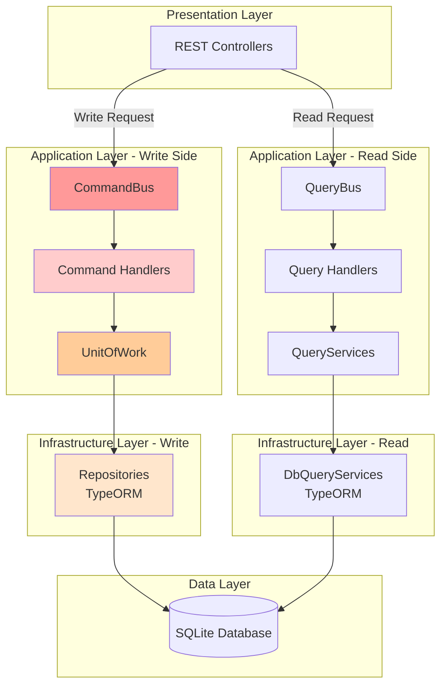
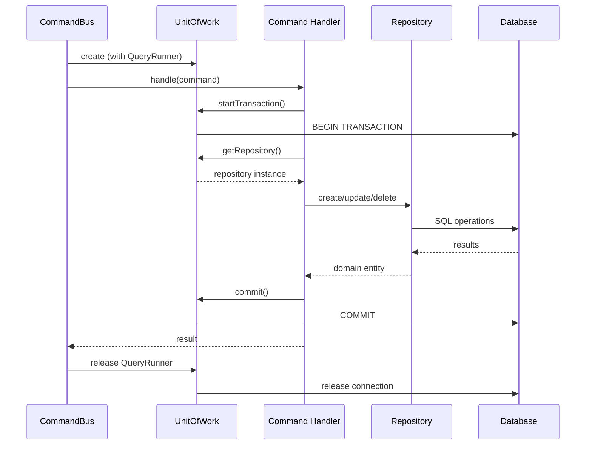

<!--
Copyright (c) Qualcomm Technologies, Inc. and/or its subsidiaries.
SPDX-License-Identifier: BSD-3-Clause
-->

# CQRS Command Pattern Guidelines

## Document Information
- **Version**: 1.0
- **Date**: March 17, 2026
- **Status**: Active Reference
- **Audience**: Developers, Architects
- **Related**: [CQRS Architecture Overview](./cqrs-architecture-overview.md) | [Query Guidelines](./cqrs-query-guidelines.md) | [Project Architecture Overview](../project-architecture-overview.md)

---

## Table of Contents
1. [Overview](#1-overview)
2. [Command Definition Guidelines](#2-command-definition-guidelines)
3. [Command Handler Guidelines](#3-command-handler-guidelines)
4. [UnitOfWork and Transaction Management](#4-unitofwork-and-transaction-management)
5. [Repository Pattern Guidelines](#5-repository-pattern-guidelines)
6. [Domain Entity Guidelines](#6-domain-entity-guidelines)
7. [Mapper Guidelines](#7-mapper-guidelines)
8. [Do's and Don'ts](#8-dos-and-donts)
9. [Complete Examples](#9-complete-examples)
10. [Implementation Checklist](#10-implementation-checklist)
11. [Quick Reference](#11-quick-reference)

---

## 1) Overview

> **Note**: This document focuses on the **Command side (write operations)** of CQRS. For query guidelines (read operations), see [Query Guidelines](./cqrs-query-guidelines.md). For a complete overview of the CQRS architecture, see [CQRS Architecture Overview](./cqrs-architecture-overview.md).

### 1.1 CQRS Architecture in AudioReach Creator

The project implements **Command Query Responsibility Segregation (CQRS)** to separate read and write operations. This document focuses on the **Command side (write operations)**.

#### Complete Architecture Context



#### Command Side Architecture (Detailed)

```mermaid
graph TB
    RC[REST Controller<br/>POST/PUT/DELETE]
    CMD[Command Object]
    CB[CommandBus]
    CH[Command Handler<br/>Orchestration]
    UOW[UnitOfWork<br/>Transaction Manager]
    REPO_INT[Repository Interface<br/>@arc/core]
    REPO_IMPL[TypeOrmRepository<br/>@arc/infrastructure]
    EM[TypeORM EntityManager]
    DB[(Database)]
    MAPPER[Mappers<br/>Bidirectional<br/>Domain ↔ DB]
    DE[Domain Entities<br/>Rich Behavior]

    RC -->|Create| CMD
    CMD --> CB
    CB -->|Create UOW| UOW
    CB -->|Dispatch| CH
    CH -->|Start Transaction| UOW
    CH -->|Get Repository| UOW
    UOW -->|Return| REPO_INT
    REPO_INT -.->|Implements| REPO_IMPL
    REPO_IMPL -->|Use| EM
    EM -->|INSERT/UPDATE/DELETE| DB
    DB -->|Return Rows| EM
    EM -->|Transform| MAPPER
    MAPPER -->|Create| DE
    DE -->|Return| CH
    CH -->|Commit| UOW
    CH -->|Return| CB
    CB -->|Release UOW| UOW
    CB -->|Return| RC

    style CB fill:#ff9999
    style CH fill:#ffcccc
    style UOW fill:#ffcc99
    style DE fill:#99ff99
```

**Key Principles:**
- **Commands** modify data (write operations) with transactions
- **Command Handlers** orchestrate business logic and control transactions
- **UnitOfWork** manages transaction lifecycle and provides repository access
- **Repositories** encapsulate data access (interfaces in core, implementations in infrastructure)
- **Domain Entities** contain business logic and validation
- **Mappers** transform between domain entities and database rows (bidirectional)
- **ACID guarantees** - all changes are atomic, consistent, isolated, and durable

**For Query side (read operations), see [Query Guidelines](./cqrs-query-guidelines.md)**

### 1.2 Current Implementation

**Command Infrastructure:**
- `CommandBus` - Creates UnitOfWork, dispatches commands to handlers, manages lifecycle
- `BaseCommand` - Base class with `id`, `timeStamp`, `clientId`
- `CommandHandler<TCommand, TResponse>` - Handler interface
- `CommandHandlerRegistry` - Handler registration and lookup
- `UnitOfWork` - Transaction management and repository access
- `UnitOfWorkFactory` - Creates UnitOfWork instances with QueryRunner

**Existing Repositories:**
- `ProjectRepository` - Project and file management
- `BulkImportRepository` - Bulk data import operations

**Command Handler Dependencies:**
```typescript
export interface CommandHandlerDependencies {
  uow: UnitOfWork;                    // Transaction management
  fileReader: FileReaderPort;         // File system access
  workerPool?: WorkerPoolPort;        // Parallel processing
  logger?: Logger;                    // Logging
  profiler?: ProfilerPort;            // Performance profiling
}
```

---

## 2) Command Definition Guidelines

### 2.1 Command Naming Convention

**Pattern:** `[Verb][Entity][Qualifier]Command`

**Examples:**
```typescript
// ✅ Good - Clear action and entity
CreateProjectCommand
UpdateModuleCommand
DeleteUseCaseCommand
OpenFileCommand
LinkModulesCommand
BulkImportModulesCommand

// ❌ Bad - Too generic or unclear
SaveCommand
DataCommand
ProcessCommand
ModifyModuleCommand  // Use specific verb like Update/Edit
```

### 2.2 Command Class Structure

**Template:**
```typescript
/**
 * Command to [describe what this command does]
 *
 * @example
 * const command = new CreateProjectCommand(name, description, clientId);
 * const result = await commandBus.execute(command);
 */
export class [CommandName] extends BaseCommand {
  constructor(
    /** [Parameter description] */
    public readonly [param1]: [Type],
    /** [Parameter description] */
    public readonly [param2]: [Type],
    clientId: string,  // Always last parameter
  ) {
    super(clientId);
  }
}
```

**Real Example:**
```typescript
/**
 * Command to create a new module in the system
 */
export class CreateModuleCommand extends BaseCommand {
  constructor(
    /** The module definition system ID */
    public readonly moduleDefinitionSystemId: number,
    /** The container system ID where module will be placed */
    public readonly containerSystemId: number,
    /** The subgraph system ID where module belongs */
    public readonly subgraphSystemId: number,
    clientId: string,
    /** Optional alias for the module */
    public readonly moduleAlias?: string,
  ) {
    super(clientId);
  }
}
```

### 2.3 Parameter Guidelines

#### Required Parameters
- All command-specific parameters must be `public readonly`
- `clientId` is always the last constructor parameter (inherited requirement)
- Use specific, strongly-typed parameters
- Order parameters logically (most important first)

#### Parameter Types

**Primitives:**
```typescript
// Entity identifiers
public readonly systemId: number
public readonly projectId: number
public readonly name: string
public readonly isEnabled: boolean
```

**Value Objects:**
```typescript
// Complex data structures
public readonly acdb: PathRef
public readonly awsp: PathRef
public readonly configuration: ModuleConfiguration
public readonly metadata: ProjectMetadata
```

**Arrays (for batch operations):**
```typescript
// Multiple entities
public readonly moduleIds: number[]
public readonly linkDefinitions: LinkDefinition[]
```

**Optional Parameters:**
```typescript
// Optional data
public readonly description?: string
public readonly alias?: string
public readonly tags?: string[]
```

### 2.4 Command Categories

#### Create Commands
```typescript
// Create new entities
CreateProjectCommand(
  name: string,
  description: string,
  type: ProjectType,
  clientId: string
)

CreateModuleCommand(
  moduleDefinitionSystemId: number,
  containerSystemId: number,
  subgraphSystemId: number,
  clientId: string,
  moduleAlias?: string
)
```

#### Update Commands
```typescript
// Modify existing entities
UpdateProjectCommand(
  projectId: number,
  updates: Partial<ProjectUpdates>,
  clientId: string
)

UpdateModulePropertiesCommand(
  moduleId: number,
  properties: ModuleProperties,
  clientId: string
)
```

#### Delete Commands
```typescript
// Remove entities
DeleteProjectCommand(
  projectId: number,
  clientId: string
)

DeleteModuleCommand(
  moduleId: number,
  clientId: string
)
```

#### Complex Operations
```typescript
// Multi-step operations
OpenFileCommand(
  clientId: string,
  acdb: PathRef,
  awsp: PathRef
)

BulkImportModulesCommand(
  fileSystemId: number,
  modules: ModuleImportData[],
  clientId: string
)

LinkModulesCommand(
  sourceModuleId: number,
  targetModuleId: number,
  linkType: LinkType,
  clientId: string
)
```

---

## 3) Command Handler Guidelines

### 3.1 Handler Structure

**Template:**
```typescript
/**
 * Handler for [CommandName]
 * [Describe what this handler does and business logic]
 */
export class [CommandName]Handler
  implements CommandHandler<[CommandName], [ReturnType]> {

  constructor(
    private uow: UnitOfWork,
    private fileReader?: FileReaderPort,
    private workerPool?: WorkerPoolPort,
    private logger?: Logger,
    private profiler?: ProfilerPort,
  ) {}

  async handle(command: [CommandName]): Promise<[ReturnType]> {
    // 1. Validate inputs
    // 2. Start transaction
    // 3. Execute business logic
    // 4. Commit transaction
    // 5. Return result
  }
}
```

**Real Example (Simple):**
```typescript
/**
 * Handler for CreateModuleCommand
 * Creates a new module in the specified container and subgraph
 */
export class CreateModuleHandler
  implements CommandHandler<CreateModuleCommand, number>
{
  constructor(private uow: UnitOfWork) {}

  async handle(command: CreateModuleCommand): Promise<number> {
    // Validate inputs
    this.validateCommand(command);

    // Start transaction
    await this.uow.startTransaction();

    try {
      // Get repository
      const moduleRepo = this.uow.getModuleRepository();

      // Create domain entity
      const module = new SpfModule(
        0, // systemId assigned by DB
        command.moduleDefinitionSystemId,
        command.containerSystemId,
        command.subgraphSystemId,
        command.moduleAlias
      );

      // Persist entity
      const savedModule = await moduleRepo.create(module);

      // Commit transaction
      await this.uow.commit();

      // Return result
      return savedModule.systemId;
    } catch (error) {
      // Rollback on error
      await this.uow.rollback();
      throw error;
    }
  }

  private validateCommand(command: CreateModuleCommand): void {
    if (command.moduleDefinitionSystemId <= 0) {
      throw new Error('Invalid module definition ID');
    }
    // Additional validations...
  }
}
```

**Real Example (Complex - Multi-Phase):**
```typescript
/**
 * Handler for OpenFileCommand
 * Opens ACDB and AWSP files, creates project, and imports data
 * Uses two-phase approach: transactional project creation + non-transactional bulk import
 */
export class OpenFileHandler
  implements CommandHandler<OpenFileCommand, OpenFileResult>
{
  private uploadOrchestrator: UploadFileOrchestrator;

  constructor(
    private readonly uow: UnitOfWork,
    private readonly fileReader: FileReaderPort,
    workerPool?: WorkerPoolPort,
    logger?: Logger,
    profiler?: ProfilerPort,
  ) {
    this.uploadOrchestrator = new UploadFileOrchestrator(
      this.fileReader,
      this.uow,
      workerPool,
      logger,
      profiler,
    );
  }

  async handle(command: OpenFileCommand): Promise<OpenFileResult> {
    // Validate inputs
    this.validateInputs(command.acdb, command.awsp);

    const projectName = this.extractProjectName(command.acdb, command.awsp);
    const projectDescription = this.extractProjectDescription(
      command.acdb,
      command.awsp,
    );

    // ========== PHASE 1: Project Creation (TRANSACTIONAL) ==========
    let project: Project;
    let fileSystemId: number;

    await this.uow.startTransaction();

    try {
      const projectRepo = this.uow.getProjectRepository();
      const result = await projectRepo.createOfflineProject(
        new Project(0, projectName, projectDescription, PROJECT_TYPE.OFFLINE),
        {
          description: `ACDB: ${command.acdb.name}, AWSP: ${command.awsp.name}`,
          metadata: 'upload',
          fileName: JSON.stringify({
            acdb: command.acdb.name,
            awsp: command.awsp.name,
            uploadedAt: new Date().toISOString(),
          }),
          isTarget: true,
        },
      );

      project = result.project;
      fileSystemId = result.file.systemId;

      await this.uow.commit();
    } catch (error) {
      await this.uow.rollback();
      throw new Error(
        `Project creation failed: ${error instanceof Error ? error.message : String(error)}`,
      );
    }

    // ========== VERIFICATION: Ensure transaction is closed ==========
    if (this.uow.isInTransaction()) {
      throw new Error(
        'Transaction state error: Phase 1 commit succeeded but transaction is still active. ' +
          'Cannot proceed to Phase 2 bulk upload.',
      );
    }

    // ========== PHASE 2: Bulk Upload (NON-TRANSACTIONAL) ==========
    // Note: UOW still has active QueryRunner (CommandBus will release it)
    // Bulk upload uses same connection but NO transaction
    await this.uploadOrchestrator.orchestrate(
      command.acdb,
      command.awsp,
      fileSystemId,
    );

    return {
      projectId: project.systemId.toString(),
      projectName: project.name,
      projectDescription: project.description,
    };
  }

  private validateInputs(acdb: PathRef, awsp: PathRef): void {
    if (!acdb.name?.toLowerCase().endsWith('.acdb')) {
      throw new Error('Invalid acdb file extension; expected .acdb');
    }
    if (!awsp.name?.toLowerCase().endsWith('.awsp')) {
      throw new Error('Invalid workspace file extension; expected .awsp');
    }
  }

  private extractProjectName(acdb: PathRef, awsp: PathRef): string {
    const acdbName = acdb.name.replace(/\.acdb$/i, '');
    const awspName = awsp.name.replace(/\.awsp$/i, '');
    return acdbName === awspName ? acdbName : `${acdbName}_project`;
  }

  private extractProjectDescription(acdb: PathRef, awsp: PathRef): string {
    return `Project created from ACDB: ${acdb.name} and AWSP: ${awsp.name}`;
  }
}
```

### 3.2 Handler Responsibilities

**✅ Handlers SHOULD:**
- Validate command inputs before starting transaction
- Control transaction boundaries explicitly (start, commit, rollback)
- Orchestrate business logic across multiple repositories
- Use domain entities for business logic
- Handle errors and rollback transactions
- Return domain entities or simple result objects
- Log important operations (if logger available)

**❌ Handlers SHOULD NOT:**
- Leave transactions open (always commit or rollback)
- Access database directly (use repositories)
- Contain complex business logic (delegate to domain entities)
- Return database rows (use domain entities)
- Swallow errors silently
- Perform read operations (use queries instead)

### 3.3 Handler Dependencies

**Command handlers receive:**
```typescript
export interface CommandHandlerDependencies {
  uow: UnitOfWork;                    // Required - transaction management
  fileReader: FileReaderPort;         // Optional - file system access
  workerPool?: WorkerPoolPort;        // Optional - parallel processing
  logger?: Logger;                    // Optional - logging
  profiler?: ProfilerPort;            // Optional - performance profiling
}
```

**Dependency Usage:**
- `uow` - **Always required** for transaction management and repository access
- `fileReader` - Use for file operations (reading ACDB, AWSP files)
- `workerPool` - Use for CPU-intensive parallel processing
- `logger` - Use for debugging and audit trails
- `profiler` - Use for performance monitoring

### 3.4 Handler Registration

**Register in CommandHandlerRegistry:**
```typescript
private registerAllCommandHandlers(): void {
  // Register each command with its handler factory
  this.commandHandlerFactories.set(CreateModuleCommand, {
    create: (deps: CommandHandlerDependencies) =>
      new CreateModuleHandler(deps.uow),
  });

  this.commandHandlerFactories.set(OpenFileCommand, {
    create: (deps: CommandHandlerDependencies) =>
      new OpenFileHandler(
        deps.uow,
        deps.fileReader,
        deps.workerPool,
        deps.logger,
        deps.profiler,
      ),
  });

  // Add more registrations...
}
```

---

## 4) UnitOfWork and Transaction Management

### 4.1 UnitOfWork Interface

```typescript
/**
 * Unit of Work pattern for managing database transactions and repository access.
 *
 * Lifecycle:
 * - Created by CommandBus with an active QueryRunner
 * - QueryRunner remains alive for the entire command execution
 * - Handlers control transaction boundaries via startTransaction/commit/rollback
 * - CommandBus releases QueryRunner after command completes
 */
export interface UnitOfWork {
  /**
   * Start a new transaction.
   * @throws Error if transaction is already active
   */
  startTransaction(): Promise<void>;

  /**
   * Commit the active transaction.
   * Note: QueryRunner remains alive after commit (CommandBus will release it)
   * @throws Error if no active transaction
   */
  commit(): Promise<void>;

  /**
   * Rollback the active transaction.
   * Note: QueryRunner remains alive after rollback (CommandBus will release it)
   * @throws Error if no active transaction
   */
  rollback(): Promise<void>;

  /**
   * Check if a transaction is currently active.
   */
  isInTransaction(): boolean;

  /**
   * Get repository instances (use shared QueryRunner from this UOW)
   */
  getBulkImportRepository(): BulkImportRepository;
  getProjectRepository(): ProjectRepository;
  // Add more repository getters as needed
}
```

### 4.2 Transaction Lifecycle



### 4.3 Transaction Patterns

#### Pattern 1: Simple Transaction (Single Phase)

```typescript
async handle(command: CreateProjectCommand): Promise<Project> {
  // Start transaction
  await this.uow.startTransaction();

  try {
    // Get repository
    const projectRepo = this.uow.getProjectRepository();

    // Execute operations
    const project = await projectRepo.create(
      new Project(0, command.name, command.description, command.type)
    );

    // Commit transaction
    await this.uow.commit();

    return project;
  } catch (error) {
    // Rollback on error
    await this.uow.rollback();
    throw error;
  }
}
```

#### Pattern 2: Multi-Repository Transaction

```typescript
async handle(command: CreateModuleWithLinksCommand): Promise<number> {
  await this.uow.startTransaction();

  try {
    // Use multiple repositories in same transaction
    const moduleRepo = this.uow.getModuleRepository();
    const linkRepo = this.uow.getLinkRepository();

    // Create module
    const module = await moduleRepo.create(
      new SpfModule(0, command.definitionId, command.containerId)
    );

    // Create links
    for (const linkDef of command.links) {
      await linkRepo.create(
        new DataLink(0, module.systemId, linkDef.targetId)
      );
    }

    await this.uow.commit();
    return module.systemId;
  } catch (error) {
    await this.uow.rollback();
    throw error;
  }
}
```

#### Pattern 3: Multi-Phase Operations

```typescript
async handle(command: ComplexCommand): Promise<Result> {
  // ========== PHASE 1: Transactional Setup ==========
  let setupResult: SetupResult;

  await this.uow.startTransaction();
  try {
    const repo = this.uow.getRepository();
    setupResult = await repo.createSetup(command.data);
    await this.uow.commit();
  } catch (error) {
    await this.uow.rollback();
    throw error;
  }

  // ========== VERIFICATION: Transaction must be closed ==========
  if (this.uow.isInTransaction()) {
    throw new Error('Transaction still active after Phase 1 commit');
  }

  // ========== PHASE 2: Non-Transactional Bulk Operations ==========
  // UOW still has QueryRunner, but no transaction
  await this.bulkProcessor.process(setupResult.id, command.bulkData);

  return { id: setupResult.id, status: 'completed' };
}
```

### 4.4 Transaction Best Practices

**✅ DO:**
```typescript
// ✅ Always use try-catch with rollback
await this.uow.startTransaction();
try {
  // operations
  await this.uow.commit();
} catch (error) {
  await this.uow.rollback();
  throw error;
}

// ✅ Verify transaction state between phases
if (this.uow.isInTransaction()) {
  throw new Error('Transaction still active');
}

// ✅ Keep transactions short and focused
await this.uow.startTransaction();
await repo.create(entity);  // Quick operation
await this.uow.commit();

// ✅ Use single transaction for related operations
await this.uow.startTransaction();
await repo1.create(entity1);
await repo2.create(entity2);  // Related to entity1
await this.uow.commit();
```

**❌ DON'T:**
```typescript
// ❌ Don't leave transactions open
await this.uow.startTransaction();
await repo.create(entity);
// Missing commit/rollback!

// ❌ Don't nest transactions
await this.uow.startTransaction();
await this.uow.startTransaction();  // Error!

// ❌ Don't perform long operations in transaction
await this.uow.startTransaction();
await this.processLargeFile();  // Takes minutes!
await this.uow.commit();

// ❌ Don't swallow errors without rollback
try {
  await this.uow.startTransaction();
  await repo.create(entity);
  await this.uow.commit();
} catch (error) {
  // Missing rollback!
  console.log(error);
}
```

### 4.5 CommandBus Transaction Safety

The `CommandBus` provides automatic safety checks:

```typescript
async execute<TResponse>(command: Command): Promise<TResponse> {
  const {uow, release} = await this.uowFactory();

  try {
    const handler = this.createHandler(command, uow);
    const result = await handler.handle(command);

    // Safety check: ensure transaction is closed
    if (uow.isInTransaction()) {
      this.logger?.logWarn('Handler left transaction open. Auto-rolling back.');
      await uow.rollback();
    }

    return result;
  } catch (error) {
    // Attempt to rollback if transaction is active
    if (uow.isInTransaction()) {
      await uow.rollback();
    }
    throw error;
  } finally {
    await release();  // Always release QueryRunner
  }
}
```

**Key Safety Features:**
- ✅ Automatic rollback if handler leaves transaction open
- ✅ Automatic rollback on errors
- ✅ Guaranteed QueryRunner release
- ✅ Logging of transaction issues

---

## 5) Repository Pattern Guidelines

### 5.1 Repository Interface Design

**Location:** `packages/core/src/application/ports/persistence/repositories/`

**Template:**
```typescript
/**
 * Repository interface for [Entity] persistence operations
 * Port in hexagonal architecture - defines contract
 */
export interface [Entity]Repository {
  // ========================================
  // Create Operations
  // ========================================

  /**
   * Create a new [entity]
   * @param entity - Domain entity to persist
   * @returns Promise resolving to persisted entity with assigned ID
   */
  create(entity: [Entity]): Promise<[Entity]>;

  /**
   * Create multiple [entities] in batch
   * @param entities - Array of domain entities
   * @returns Promise resolving to persisted entities
   */
  createBatch(entities: [Entity][]): Promise<[Entity][]>;

  // ========================================
  // Read Operations (minimal - prefer queries)
  // ========================================

  /**
   * Find [entity] by ID (for command validation)
   * @param id - Entity system ID
   * @returns Promise resolving to entity or null
   */
  findById(id: number): Promise<[Entity] | null>;

  // ========================================
  // Update Operations
  // ========================================

  /**
   * Update existing [entity]
   * @param entity - Domain entity with changes
   * @returns Promise resolving to updated entity
   */
  update(entity: [Entity]): Promise<[Entity]>;

  // ========================================
  // Delete Operations
  // ========================================

  /**
   * Delete [entity] by ID
   * @param id - Entity system ID
   * @returns Promise resolving when deleted
   */
  delete(id: number): Promise<void>;
}
```

**Real Example:**
```typescript
/**
 * Repository interface for Project persistence operations
 */
export interface ProjectRepository {
  // ========================================
  // Create Operations
  // ========================================

  /**
   * Create offline project with initial file (for upload-file workflow)
   * @param project - Project domain entity (without systemId and type)
   * @param file - Initial file data (without systemId and projectSystemId)
   * @returns Promise resolving to created project and file
   */
  createOfflineProject(
    project: Omit<Project, 'systemId' | 'type'>,
    file: Omit<ArcDbFile, 'systemId' | 'projectSystemId'>,
  ): Promise<{project: Project; file: ArcDbFile}>;

  /**
   * Create connected project (for future use)
   * @param project - Project domain entity
   * @returns Promise resolving to created project
   */
  createConnectedProject(
    project: Omit<Project, 'systemId' | 'type'>,
  ): Promise<Project>;

  /**
   * Add file to existing project
   * @param projectSystemId - Project system ID
   * @param file - File data
   * @returns Promise resolving to created file
   */
  addFile(
    projectSystemId: number,
    file: Omit<ArcDbFile, 'systemId' | 'projectSystemId'>,
  ): Promise<ArcDbFile>;

  // ========================================
  // Read Operations (minimal)
  // ========================================

  findProjectById(systemId: number): Promise<Project | null>;
  findProjectByName(name: string): Promise<Project | null>;

  // ========================================
  // Update Operations
  // ========================================

  /**
   * Update project (only name/description, files are immutable)
   * @param systemId - Project system ID
   * @param updates - Partial updates
   */
  updateProject(
    systemId: number,
    updates: Partial<Pick<Project, 'name' | 'description'>>,
  ): Promise<void>;

  // ========================================
  // Delete Operations
  // ========================================

  /**
   * Delete project (cascade deletes files)
   * @param systemId - Project system ID
   */
  deleteProject(systemId: number): Promise<void>;
}
```

### 5.2 Repository Implementation

**Location:** `packages/infrastructure/persistence/src/persistence-typeorm-sqllite/repositories/`

**Template:**
```typescript
/**
 * TypeORM implementation of [Entity]Repository
 * Adapter in hexagonal architecture - implements port
 */
export class TypeOrm[Entity]Repository implements [Entity]Repository {
  constructor(private readonly manager: EntityManager) {}

  async create(entity: [Entity]): Promise<[Entity]> {
    // 1. Map domain entity to database row
    const row = to[Entity]Row(entity);

    // 2. Insert into database
    const result = await this.manager.insert([Entity]Schema.options.name, row);
    const systemId = result.identifiers[0].systemId as number;

    // 3. Query back to get complete row
    const savedRow = await this.manager.findOneOrFail(
      [Entity]Schema.options.name,
      { where: { systemId } }
    );

    // 4. Map database row to domain entity
    return to[Entity]Domain(savedRow as [Entity]Row);
  }

  // Implement other methods...
}
```

**Real Example:**
```typescript
/**
 * TypeORM implementation of ProjectRepository
 */
export class TypeOrmProjectRepository implements ProjectRepository {
  constructor(private readonly manager: EntityManager) {}

  async createOfflineProject(
    project: Omit<Project, 'systemId' | 'type'>,
    file: Omit<ArcDbFile, 'systemId' | 'projectSystemId'>,
  ): Promise<{project: Project; file: ArcDbFile}> {
    // 1. Map project domain to row (add OFFLINE type)
    const projectRow: EntityRowForInsert<ProjectRow> = toProjectRow({
      ...project,
      type: PROJECT_TYPE.OFFLINE,
    } as Project);

    // 2. Insert project
    const projectInsertResult = await this.manager.insert(
      ProjectSchema.options.name,
      projectRow,
    );
    const projectSystemId = projectInsertResult.identifiers[0]
      .systemId as number;

    // 3. Query back project to get complete row
    const savedProjectRow = await this.manager.findOneOrFail(
      ProjectSchema.options.name,
      { where: { systemId: projectSystemId } },
    );

    // 4. Map file domain to row (add FK to project)
    const fileRow = toArcDbFileRow(file, projectSystemId);

    // 5. Insert file
    const fileInsertResult = await this.manager.insert(
      ArcDbFileSchema.options.name,
      fileRow,
    );
    const fileSystemId = fileInsertResult.identifiers[0].systemId as number;

    // 6. Query back file to get complete row
    const savedFileRow = await this.manager.findOneOrFail(
      ArcDbFileSchema.options.name,
      { where: { systemId: fileSystemId } },
    );

    // 7. Map rows to domain entities
    return {
      project: toProjectDomain(savedProjectRow as ProjectRow),
      file: toArcDbFileDomain(savedFileRow as ArcDbFileRow),
    };
  }

  // Other methods...
}
```

### 5.3 Repository Best Practices

**✅ DO:**
```typescript
// ✅ Use EntityManager from UnitOfWork
constructor(private readonly manager: EntityManager) {}

// ✅ Map domain entities to/from database rows
const row = toDomainRow(entity);
const entity = toDomain(row);

// ✅ Query back after insert to get complete data
const result = await this.manager.insert(schema, row);
const savedRow = await this.manager.findOneOrFail(schema, { where: { id } });

// ✅ Return domain entities, not database rows
return toDomain(savedRow);

// ✅ Use descriptive method names
createOfflineProject()  // Not: createProject()
addFile()              // Not: insertFile()
```

**❌ DON'T:**
```typescript
// ❌ Don't create your own EntityManager
const manager = dataSource.createEntityManager();  // Wrong!

// ❌ Don't return database rows
return savedRow;  // Return domain entity instead

// ❌ Don't include complex queries (use QueryServices)
async findProjectsWithModules() { }  // Use QueryService instead

// ❌ Don't manage transactions in repository
await this.manager.transaction(async () => { });  // Handler's job

// ❌ Don't include business logic
if (project.isValid()) { }  // Domain entity's job
```

---

## 6) Domain Entity Guidelines

### 6.1 Domain Entity Structure

**Location:** `packages/core/src/domain/entities/`

**Template:**
```typescript
/**
 * Domain entity for [Entity]
 * Contains business logic and validation
 */
export class [Entity] {
  // Readonly properties (immutable after creation)
  readonly systemId: number;
  readonly [property1]: [Type];
  readonly [property2]: [Type];

  // Mutable properties (if needed)
  private [mutableProperty]: [Type];

  constructor(
    systemId: number,
    [property1]: [Type],
    [property2]: [Type],
  ) {
    // Validate inputs
    this.validate[Property1]([property1]);

    // Assign properties
    this.systemId = systemId;
    this.[property1] = [property1];
    this.[property2] = [property2];
  }

  // Business logic methods
  [businessMethod](): void {
    // Implement business logic
  }

  // Validation methods
  private validate[Property](value: [Type]): void {
    if (/* invalid */) {
      throw new [Entity]ValidationException('message');
    }
  }
}
```

**Real Example:**
```typescript
/**
 * Domain entity for Project
 * Manages project lifecycle and file associations
 */
export class Project {
  private readonly arcDbFilesIds = new Set<number>();

  readonly systemId: number;
  readonly name: string;
  readonly description: string;
  readonly type: ProjectType;
  readonly arcDbFiles: ArcDbFile[] = [];

  constructor(
    systemId: number,
    name: string,
    description: string,
    type: ProjectType,
  ) {
    this.systemId = systemId;
    this.name = name;
    this.description = description;
    this.type = type;
  }

  /**
   * Add file to project
   * Business rule: No duplicate files
   */
  addFile(arcDbFile: ArcDbFile): void {
    if (this.arcDbFilesIds.has(arcDbFile.systemId)) {
      throw new DuplicateFileException(arcDbFile.systemId);
    }
    this.arcDbFilesIds.add(arcDbFile.systemId);
    this.arcDbFiles.push(arcDbFile);
  }
}

/**
 * Domain exception for duplicate files
 */
export class DuplicateFileException extends Error {
  constructor(fileId: number) {
    super(`File with sys-id: ${fileId} exists`);
    this.name = 'DuplicateFileException';
  }
}
```

### 6.2 Domain Entity Principles

**Rich Domain Model:**
- Encapsulate business logic in entity methods
- Validate invariants in constructor and methods
- Throw domain exceptions for business rule violations
- Use meaningful method names that express intent

**Immutability:**
- Use `readonly` for properties that shouldn't change
- Use private setters for controlled mutations
- Return new instances for modifications (if applicable)

**Validation:**
- Validate in constructor (fail fast)
- Validate in business methods before state changes
- Throw descriptive domain exceptions

**Example Patterns:**
```typescript
// ✅ Rich behavior
class Module {
  enable(): void {
    if (this.isEnabled) {
      throw new ModuleAlreadyEnabledException(this.systemId);
    }
    this.isEnabled = true;
  }

  disable(): void {
    if (!this.isEnabled) {
      throw new ModuleAlreadyDisabledException(this.systemId);
    }
    this.isEnabled = false;
  }

  connectTo(targetModule: Module): DataLink {
    if (!this.canConnectTo(targetModule)) {
      throw new InvalidConnectionException(this.systemId, targetModule.systemId);
    }
    return new DataLink(0, this.systemId, targetModule.systemId);
  }

  private canConnectTo(target: Module): boolean {
    // Business logic to determine if connection is valid
    return this.subgraphId === target.subgraphId;
  }
}
```

---

## 7) Mapper Guidelines

### 7.1 Mapper Purpose

Mappers transform between **Domain Entities** and **Database Rows** (bidirectional).

```
Domain Entity ←→ Mapper ←→ Database Row
(Business Logic)         (Persistence)
```

**Key Differences from Query Mappers:**
- **Command Mappers**: Bidirectional (Domain ↔ DB)
- **Query Mappers**: Unidirectional (DB → Read Model)

### 7.2 Mapper Structure

**Location:** `packages/infrastructure/persistence/src/persistence-typeorm-sqllite/repositories/[entity]/[entity]-mapper.ts`

**Template:**
```typescript
/**
 * Bidirectional mapper for [Entity]
 * Transforms between domain entity and database row
 */

// ========================================
// Domain → Database (for INSERT/UPDATE)
// ========================================

/**
 * Map domain entity to database row for insert
 * @param entity - Domain entity (without systemId)
 * @returns Database row ready for insert
 */
export function to[Entity]Row(
  entity: Omit<[Entity], 'systemId'>
): EntityRowForInsert<[Entity]Row> {
  return {
    [property1]: entity.[property1],
    [property2]: entity.[property2],
    // Map all properties
  };
}

// ========================================
// Database → Domain (for SELECT)
// ========================================

/**
 * Map database row to domain entity
 * @param row - Database row
 * @returns Domain entity
 */
export function to[Entity]Domain(row: [Entity]Row): [Entity] {
  return new [Entity](
    row.systemId,
    row.[property1],
    row.[property2],
    // Map all properties
  );
}
```

**Real Example:**
```typescript
/**
 * Bidirectional mapper for Project and ArcDbFile
 */

// ========================================
// Project: Domain → Database
// ========================================

export function toProjectRow(
  entity: Omit<Project, 'systemId'>,
): EntityRowForInsert<ProjectRow> {
  return {
    name: entity.name,
    description: entity.description,
    type: entity.type,
  };
}

// ========================================
// Project: Database → Domain
// ========================================

export function toProjectDomain(row: ProjectRow): Project {
  return new Project(
    row.systemId,
    row.name,
    row.description,
    row.type as ProjectType,  // Cast string to enum
  );
}

// ========================================
// ArcDbFile: Domain → Database
// ========================================

export function toArcDbFileRow(
  file: Omit<ArcDbFile, 'systemId' | 'projectSystemId'>,
  projectSystemId: number,
): EntityRowForInsert<ArcDbFileRow> {
  return {
    description: file.description,
    metadata: file.metadata,
    fileName: file.fileName,
    isTarget: file.isTarget,
    projectSystemId,  // Add FK
  };
}

// ========================================
// ArcDbFile: Database → Domain
// ========================================

export function toArcDbFileDomain(row: ArcDbFileRow): ArcDbFile {
  return new ArcDbFile({
    systemId: row.systemId,
    description: row.description,
    metadata: row.metadata,
    fileName: row.fileName,
    isTarget: row.isTarget,
    projectSystemId: row.projectSystemId,
  });
}
```

### 7.3 Mapper Best Practices

**✅ DO:**
```typescript
// ✅ Use pure functions (no side effects)
export function toDomain(row: Row): Entity { }

// ✅ Handle type conversions
type: row.type as ProjectType  // String to enum

// ✅ Map all required properties
return new Entity(
  row.systemId,
  row.property1,
  row.property2,
  // All properties
);

// ✅ Add foreign keys when mapping to row
return {
  ...data,
  parentId: parentSystemId,  // FK
};

// ✅ Use descriptive function names
toProjectDomain()  // Clear direction
toProjectRow()     // Clear direction
```

**❌ DON'T:**
```typescript
// ❌ Don't include business logic
export function toDomain(row: Row): Entity {
  const entity = new Entity(row.id);
  entity.validate();  // Business logic - wrong place!
  return entity;
}

// ❌ Don't perform database operations
export function toDomain(row: Row): Entity {
  const related = await db.query(...);  // No DB access!
  return new Entity(row.id, related);
}

// ❌ Don't use generic names
export function map(data: any): any { }  // Too generic

// ❌ Don't mix concerns
export function toRowAndSave(entity: Entity): void { }  // Do one thing
```

---

## 8) Do's and Don'ts

### 8.1 Command Definition

#### ✅ DO:

```typescript
// ✅ Use descriptive, action-oriented names
export class CreateProjectCommand extends BaseCommand { }
export class UpdateModuleCommand extends BaseCommand { }
export class DeleteUseCaseCommand extends BaseCommand { }

// ✅ Use readonly properties
public readonly projectId: number

// ✅ Document command purpose
/**
 * Command to create a new project with initial configuration
 * Used for: Project creation workflow
 */

// ✅ Use specific types
public readonly type: ProjectType  // Not: string
public readonly ids: number[]      // Not: any[]
```

#### ❌ DON'T:

```typescript
// ❌ Generic, unclear names
export class SaveCommand extends BaseCommand { }
export class ProcessCommand extends BaseCommand { }

// ❌ Mutable properties
public projectId: number  // Missing readonly

// ❌ Missing documentation
export class CreateProjectCommand extends BaseCommand { }

// ❌ Using 'any' type
public readonly data: any
```

### 8.2 Command Handlers

#### ✅ DO:

```typescript
// ✅ Always use try-catch with transaction
await this.uow.startTransaction();
try {
  // operations
  await this.uow.commit();
} catch (error) {
  await this.uow.rollback();
  throw error;
}

// ✅ Validate inputs before transaction
private validateCommand(command: CreateModuleCommand): void {
  if (command.definitionId <= 0) {
    throw new Error('Invalid definition ID');
  }
}

// ✅ Return domain entities or simple results
return savedProject;  // Domain entity
return { id: project.systemId, name: project.name };  // Simple result

// ✅ Use domain entities for business logic
const project = new Project(0, name, description, type);
project.addFile(file);  // Business logic in entity
```

#### ❌ DON'T:

```typescript
// ❌ Leaving transactions open
await this.uow.startTransaction();
await repo.create(entity);
// Missing commit/rollback!

// ❌ Accessing database directly
const result = await this.dataSource.query('SELECT ...');  // Use repository!

// ❌ Complex business logic in handler
async handle(command: CreateModuleCommand): Promise<number> {
  // 100 lines of business logic here  // Move to domain entity!
}

// ❌ Returning database rows
return savedRow;  // Return domain entity instead
```

### 8.3 Repositories

#### ✅ DO:

```typescript
// ✅ Use EntityManager from constructor
constructor(private readonly manager: EntityManager) {}

// ✅ Map domain entities to/from rows
const row = toProjectRow(entity);
const entity = toProjectDomain(row);

// ✅ Query back after insert
const result = await this.manager.insert(schema, row);
const savedRow = await this.manager.findOneOrFail(schema, { where: { id } });

// ✅ Return domain entities
return toProjectDomain(savedRow);
```

#### ❌ DON'T:

```typescript
// ❌ Creating your own EntityManager
const manager = dataSource.createEntityManager();

// ❌ Including complex queries
async findProjectsWithAllRelations() { }  // Use QueryService

// ❌ Managing transactions
await this.manager.transaction(async () => { });  // Handler's job

// ❌ Including business logic
if (project.isValid()) { }  // Domain entity's job
```

### 8.4 Domain Entities

#### ✅ DO:

```typescript
// ✅ Encapsulate business logic
class Project {
  addFile(file: ArcDbFile): void {
    if (this.arcDbFilesIds.has(file.systemId)) {
      throw new DuplicateFileException(file.systemId);
    }
    this.arcDbFilesIds.add(file.systemId);
    this.arcDbFiles.push(file);
  }
}

// ✅ Validate in constructor
constructor(systemId: number, name: string) {
  if (!name || name.trim().length === 0) {
    throw new InvalidProjectNameException();
  }
  this.systemId = systemId;
  this.name = name;
}

// ✅ Use readonly for immutable properties
readonly systemId: number;
readonly name: string;

// ✅ Throw domain exceptions
throw new DuplicateFileException(fileId);
```

#### ❌ DON'T:

```typescript
// ❌ Anemic domain model (no behavior)
class Project {
  systemId: number;
  name: string;
  // No methods, just data
}

// ❌ Public mutable properties
public systemId: number;  // Should be readonly

// ❌ No validation
constructor(systemId: number, name: string) {
  this.systemId = systemId;
  this.name = name;  // No validation!
}

// ❌ Generic exceptions
throw new Error('Invalid');  // Use domain exception
```

### 8.5 Transaction Management

#### ✅ DO:

```typescript
// ✅ Keep transactions short
await this.uow.startTransaction();
await repo.create(entity);  // Quick operation
await this.uow.commit();

// ✅ Verify transaction state between phases
if (this.uow.isInTransaction()) {
  throw new Error('Transaction still active');
}

// ✅ Use single transaction for related operations
await this.uow.startTransaction();
await projectRepo.create(project);
await fileRepo.create(file);  // Related to project
await this.uow.commit();
```

#### ❌ DON'T:

```typescript
// ❌ Long-running operations in transaction
await this.uow.startTransaction();
await this.processLargeFile();  // Takes minutes!
await this.uow.commit();

// ❌ Nested transactions
await this.uow.startTransaction();
await this.uow.startTransaction();  // Error!

// ❌ Swallowing errors without rollback
try {
  await this.uow.startTransaction();
  await repo.create(entity);
  await this.uow.commit();
} catch (error) {
  console.log(error);  // Missing rollback!
}
```

---

## 9) Complete Examples

### 9.1 Simple CRUD Command

**Scenario:** Create a new project

**1. Define Command:**
```typescript
// packages/core/src/application/project/create/create-project.command.ts

/**
 * Command to create a new project
 */
export class CreateProjectCommand extends BaseCommand {
  constructor(
    /** Project name */
    public readonly name: string,
    /** Project description */
    public readonly description: string,
    /** Project type (OFFLINE or DEVICE) */
    public readonly type: ProjectType,
    clientId: string,
  ) {
    super(clientId);
  }
}
```

**2. Implement Handler:**
```typescript
// packages/core/src/application/project/create/create-project.handler.ts

/**
 * Handler for CreateProjectCommand
 * Creates a new project in the system
 */
export class CreateProjectHandler
  implements CommandHandler<CreateProjectCommand, Project>
{
  constructor(private uow: UnitOfWork) {}

  async handle(command: CreateProjectCommand): Promise<Project> {
    // Validate inputs
    this.validateCommand(command);

    // Start transaction
    await this.uow.startTransaction();

    try {
      // Get repository
      const projectRepo = this.uow.getProjectRepository();

      // Create domain entity
      const project = new Project(
        0,  // systemId assigned by DB
        command.name,
        command.description,
        command.type,
      );

      // Persist entity
      const savedProject = await projectRepo.create(project);

      // Commit transaction
      await this.uow.commit();

      // Return domain entity
      return savedProject;
    } catch (error) {
      // Rollback on error
      await this.uow.rollback();
      throw error;
    }
  }

  private validateCommand(command: CreateProjectCommand): void {
    if (!command.name || command.name.trim().length === 0) {
      throw new Error('Project name is required');
    }
    if (command.name.length > 255) {
      throw new Error('Project name too long (max 255 characters)');
    }
  }
}
```

**3. Register Handler:**
```typescript
// packages/core/src/application/orchestration/cqrs/registries/
// command-handler-registry.ts

private registerAllCommandHandlers(): void {
  this.commandHandlerFactories.set(CreateProjectCommand, {
    create: (deps: CommandHandlerDependencies) =>
      new CreateProjectHandler(deps.uow),
  });
}
```

**4. Use in Controller:**
```typescript
// packages/api/src/presentation/rest/modules/project/project.controller.ts

@Controller('projects')
export class ProjectController {
  constructor(private readonly commandBus: CommandBus) {}

  @Post()
  async createProject(
    @Body() dto: CreateProjectDto,
    @Headers('client-id') clientId: string,
  ): Promise<ProjectResponse> {
    const command = new CreateProjectCommand(
      dto.name,
      dto.description,
      dto.type,
      clientId,
    );

    const project = await this.commandBus.execute(command);

    return {
      id: project.systemId,
      name: project.name,
      description: project.description,
      type: project.type,
    };
  }
}
```

### 9.2 Complex Multi-Phase Command

**Scenario:** Open file (create project + bulk import)

**1. Define Command:**
```typescript
// packages/core/src/application/file-operations/upload-file/
// upload-file.command.ts

/**
 * Command to open ACDB and AWSP files
 * Creates project and imports all data
 */
export class OpenFileCommand extends BaseCommand {
  constructor(
    clientId: string,
    /** ACDB file reference */
    public readonly acdb: PathRef,
    /** AWSP file reference */
    public readonly awsp: PathRef,
  ) {
    super(clientId);
  }
}
```

**2. Implement Handler:**
```typescript
// packages/core/src/application/file-operations/upload-file/
// upload-file.handler.ts

export type OpenFileResult = {
  projectId: string;
  projectName: string;
  projectDescription: string;
};

/**
 * Handler for OpenFileCommand
 * Two-phase operation:
 * 1. Transactional project creation
 * 2. Non-transactional bulk data import
 */
export class OpenFileHandler
  implements CommandHandler<OpenFileCommand, OpenFileResult>
{
  private uploadOrchestrator: UploadFileOrchestrator;

  constructor(
    private readonly uow: UnitOfWork,
    private readonly fileReader: FileReaderPort,
    workerPool?: WorkerPoolPort,
    logger?: Logger,
    profiler?: ProfilerPort,
  ) {
    this.uploadOrchestrator = new UploadFileOrchestrator(
      this.fileReader,
      this.uow,
      workerPool,
      logger,
      profiler,
    );
  }

  async handle(command: OpenFileCommand): Promise<OpenFileResult> {
    // Validate inputs
    this.validateInputs(command.acdb, command.awsp);

    const projectName = this.extractProjectName(command.acdb, command.awsp);
    const projectDescription = this.extractProjectDescription(
      command.acdb,
      command.awsp,
    );

    // ========== PHASE 1: Project Creation (TRANSACTIONAL) ==========
    let project: Project;
    let fileSystemId: number;

    await this.uow.startTransaction();

    try {
      const projectRepo = this.uow.getProjectRepository();
      const result = await projectRepo.createOfflineProject(
        new Project(0, projectName, projectDescription, PROJECT_TYPE.OFFLINE),
        {
          description: `ACDB: ${command.acdb.name}, AWSP: ${command.awsp.name}`,
          metadata: 'upload',
          fileName: JSON.stringify({
            acdb: command.acdb.name,
            awsp: command.awsp.name,
            uploadedAt: new Date().toISOString(),
          }),
          isTarget: true,
        },
      );

      project = result.project;
      fileSystemId = result.file.systemId;

      await this.uow.commit();
    } catch (error) {
      await this.uow.rollback();
      throw new Error(
        `Project creation failed: ${error instanceof Error ? error.message : String(error)}`,
      );
    }

    // ========== VERIFICATION: Ensure transaction is closed ==========
    if (this.uow.isInTransaction()) {
      throw new Error(
        'Transaction state error: Phase 1 commit succeeded but transaction is still active. ' +
          'Cannot proceed to Phase 2 bulk upload.',
      );
    }

    // ========== PHASE 2: Bulk Upload (NON-TRANSACTIONAL) ==========
    // Note: UOW still has active QueryRunner (CommandBus will release it)
    // Bulk upload uses same connection but NO transaction
    await this.uploadOrchestrator.orchestrate(
      command.acdb,
      command.awsp,
      fileSystemId,
    );

    return {
      projectId: project.systemId.toString(),
      projectName: project.name,
      projectDescription: project.description,
    };
  }

  private validateInputs(acdb: PathRef, awsp: PathRef): void {
    if (!acdb.name?.toLowerCase().endsWith('.acdb')) {
      throw new Error('Invalid acdb file extension; expected .acdb');
    }
    if (!awsp.name?.toLowerCase().endsWith('.awsp')) {
      throw new Error('Invalid workspace file extension; expected .awsp');
    }
  }

  private extractProjectName(acdb: PathRef, awsp: PathRef): string {
    const acdbName = acdb.name.replace(/\.acdb$/i, '');
    const awspName = awsp.name.replace(/\.awsp$/i, '');
    return acdbName === awspName ? acdbName : `${acdbName}_project`;
  }

  private extractProjectDescription(acdb: PathRef, awsp: PathRef): string {
    return `Project created from ACDB: ${acdb.name} and AWSP: ${awsp.name}`;
  }
}
```

**3. Register Handler:**
```typescript
private registerAllCommandHandlers(): void {
  this.commandHandlerFactories.set(OpenFileCommand, {
    create: (deps: CommandHandlerDependencies) =>
      new OpenFileHandler(
        deps.uow,
        deps.fileReader,
        deps.workerPool,
        deps.logger,
        deps.profiler,
      ),
  });
}
```

### 9.3 Multi-Repository Transaction

**Scenario:** Create module with links

**Handler Implementation:**
```typescript
/**
 * Handler for CreateModuleWithLinksCommand
 * Creates module and establishes connections in single transaction
 */
export class CreateModuleWithLinksHandler
  implements CommandHandler<CreateModuleWithLinksCommand, number>
{
  constructor(private uow: UnitOfWork) {}

  async handle(command: CreateModuleWithLinksCommand): Promise<number> {
    await this.uow.startTransaction();

    try {
      // Get repositories
      const moduleRepo = this.uow.getModuleRepository();
      const linkRepo = this.uow.getLinkRepository();

      // Create module
      const module = new SpfModule(
        0,
        command.definitionId,
        command.containerId,
        command.subgraphId,
        command.alias,
      );
      const savedModule = await moduleRepo.create(module);

      // Create links
      for (const linkDef of command.links) {
        const link = new DataLink(
          0,
          savedModule.systemId,
          linkDef.targetModuleId,
          linkDef.sourcePortId,
          linkDef.targetPortId,
        );
        await linkRepo.create(link);
      }

      await this.uow.commit();
      return savedModule.systemId;
    } catch (error) {
      await this.uow.rollback();
      throw error;
    }
  }
}
```

---

## 10) Implementation Checklist

### For Each New Command:

- [ ] **Define Command Class**
  - [ ] Extends `BaseCommand`
  - [ ] Descriptive name following `[Verb][Entity]Command` pattern
  - [ ] All parameters are `public readonly`
  - [ ] `clientId` is last parameter
  - [ ] JSDoc documentation included

- [ ] **Implement Command Handler**
  - [ ] Implements `CommandHandler<TCommand, TResponse>`
  - [ ] Constructor receives appropriate dependencies from `CommandHandlerDependencies`
  - [ ] Validates inputs before starting transaction
  - [ ] Uses try-catch with transaction management
  - [ ] Calls `uow.startTransaction()` before operations
  - [ ] Calls `uow.commit()` on success
  - [ ] Calls `uow.rollback()` on error
  - [ ] Returns domain entity or simple result object
  - [ ] JSDoc documentation included

- [ ] **Register Handler**
  - [ ] Added to `CommandHandlerRegistry.registerAllCommandHandlers()`
  - [ ] Factory creates handler with correct dependencies

- [ ] **Create/Update Repository** (if needed)
  - [ ] Interface defined in `@arc/core/application/ports/persistence/repositories/`
  - [ ] Implementation in `@arc/infrastructure/persistence/repositories/`
  - [ ] Methods added to `UnitOfWork` interface
  - [ ] Repository uses `EntityManager` from constructor
  - [ ] Returns domain entities, not database rows

- [ ] **Create/Update Domain Entity** (if needed)
  - [ ] Located in `@arc/core/domain/entities/`
  - [ ] Contains business logic and validation
  - [ ] Uses `readonly` for immutable properties
  - [ ] Validates in constructor
  - [ ] Throws domain exceptions for business rule violations

- [ ] **Create/Update Mappers** (if needed)
  - [ ] Located in `@arc/infrastructure/persistence/repositories/[entity]/`
  - [ ] `to[Entity]Row()` - Domain to Database
  - [ ] `to[Entity]Domain()` - Database to Domain
  - [ ] Pure functions (no side effects)
  - [ ] Handle type conversions

- [ ] **Update Controller** (if new endpoint)
  - [ ] Accept command parameters in request body
  - [ ] Create command instance
  - [ ] Execute via CommandBus
  - [ ] Return appropriate response

- [ ] **Write Tests**
  - [ ] Unit tests for handler
  - [ ] Unit tests for domain entity
  - [ ] Integration tests for repository
  - [ ] E2E tests for complete flow

---

## 11) Quick Reference

### Command Naming Patterns
```typescript
Create[Entity]Command           // CreateProjectCommand
Update[Entity]Command           // UpdateModuleCommand
Delete[Entity]Command           // DeleteUseCaseCommand
[Verb][Entity]Command           // OpenFileCommand, LinkModulesCommand
Bulk[Operation][Entity]Command  // BulkImportModulesCommand
```

### Handler Pattern
```typescript
export class [Command]Handler implements CommandHandler<[Command], [Result]> {
  constructor(private uow: UnitOfWork) {}

  async handle(command: [Command]): Promise<[Result]> {
    await this.uow.startTransaction();
    try {
      // Business logic
      await this.uow.commit();
      return result;
    } catch (error) {
      await this.uow.rollback();
      throw error;
    }
  }
}
```

### Transaction Pattern
```typescript
// Start transaction
await this.uow.startTransaction();

try {
  // Get repository
  const repo = this.uow.getRepository();

  // Execute operations
  const entity = await repo.create(domainEntity);

  // Commit
  await this.uow.commit();

  return entity;
} catch (error) {
  // Rollback on error
  await this.uow.rollback();
  throw error;
}
```

### Repository Pattern
```typescript
// Interface (in @arc/core)
export interface [Entity]Repository {
  create(entity: [Entity]): Promise<[Entity]>;
  update(entity: [Entity]): Promise<[Entity]>;
  delete(id: number): Promise<void>;
  findById(id: number): Promise<[Entity] | null>;
}

// Implementation (in @arc/infrastructure)
export class TypeOrm[Entity]Repository implements [Entity]Repository {
  constructor(private readonly manager: EntityManager) {}

  async create(entity: [Entity]): Promise<[Entity]> {
    const row = to[Entity]Row(entity);
    const result = await this.manager.insert(schema, row);
    const savedRow = await this.manager.findOneOrFail(schema, { where: { id } });
    return to[Entity]Domain(savedRow);
  }
}
```

### Domain Entity Pattern
```typescript
export class [Entity] {
  readonly systemId: number;
  readonly [property]: [Type];

  constructor(systemId: number, [property]: [Type]) {
    this.validate[Property]([property]);
    this.systemId = systemId;
    this.[property] = [property];
  }

  [businessMethod](): void {
    // Business logic with validation
    if (/* invalid */) {
      throw new [Entity]ValidationException('message');
    }
    // Perform operation
  }

  private validate[Property](value: [Type]): void {
    if (/* invalid */) {
      throw new Invalid[Property]Exception(value);
    }
  }
}
```

### Mapper Pattern
```typescript
// Domain → Database
export function to[Entity]Row(
  entity: Omit<[Entity], 'systemId'>
): EntityRowForInsert<[Entity]Row> {
  return {
    property1: entity.property1,
    property2: entity.property2,
  };
}

// Database → Domain
export function to[Entity]Domain(row: [Entity]Row): [Entity] {
  return new [Entity](
    row.systemId,
    row.property1,
    row.property2,
  );
}
```

### File Organization
```
packages/core/src/application/
├── [feature]/
│   └── [operation]/
│       ├── [operation].command.ts
│       └── [operation].handler.ts
└── ports/persistence/repositories/
    └── [entity]/
        └── [entity].repository.ts

packages/core/src/domain/entities/
└── [entity]/
    └── [entity].ts

packages/infrastructure/persistence/src/
└── repositories/
    └── [entity]/
        ├── typeorm-[entity].repository.ts
        └── [entity]-mapper.ts
```

---

## Document Revision History

| Version | Date | Author | Changes |
|---------|------|--------|---------|
| 1.0 | 2026-03-17 | Architecture Team | Initial CQRS command guidelines based on existing architecture and implementations |

---

**End of Document**
