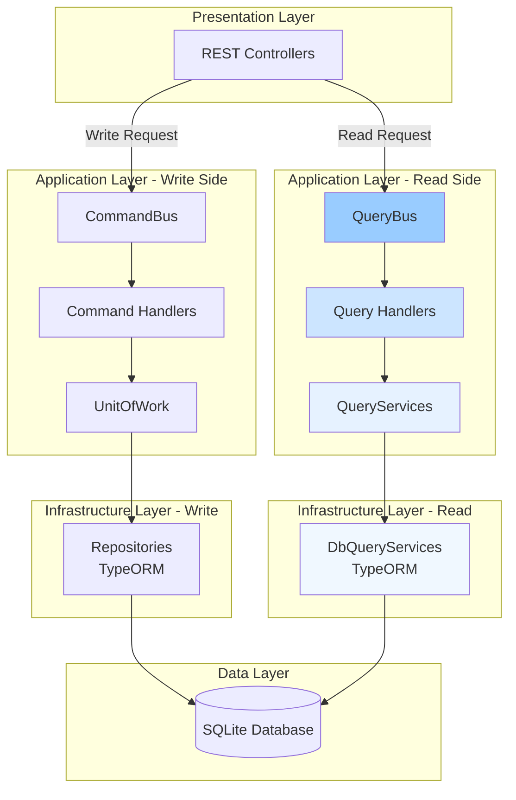

<!--
Copyright (c) Qualcomm Technologies, Inc. and/or its subsidiaries.
SPDX-License-Identifier: BSD-3-Clause
-->

# CQRS Query Pattern Guidelines

## Document Information
- **Version**: 3.0
- **Date**: March 17, 2026
- **Status**: Active Reference
- **Audience**: Developers, Architects
- **Related**: [CQRS Architecture Overview](./cqrs-architecture-overview.md) | [Command Guidelines](./cqrs-command-guidelines.md) | [Project Architecture Overview](../project-architecture-overview.md)

---

## Table of Contents
1. [Overview](#1-overview)
2. [Query Definition Guidelines](#2-query-definition-guidelines)
3. [Query Handler Guidelines](#3-query-handler-guidelines)
4. [Query Service Interface Design](#4-query-service-interface-design)
5. [Read Model Design](#5-read-model-design)
6. [Complete Read Model Catalog](#6-complete-read-model-catalog)
7. [Do's and Don'ts](#7-dos-and-donts)
8. [Examples](#8-examples)

---

## 1) Overview

> **Note**: This document focuses on the **Query side (read operations)** of CQRS. For command guidelines (write operations), see [Command Guidelines](./cqrs-command-guidelines.md). For a complete overview of the CQRS architecture, see [CQRS Architecture Overview](./cqrs-architecture-overview.md).

### 1.1 CQRS Architecture in AudioReach Creator

The project implements **Command Query Responsibility Segregation (CQRS)** to separate read and write operations. This document focuses on the **Query side (read operations)**.

#### Complete Architecture Context



#### Query Side Architecture (Detailed)

```mermaid
graph TB
    RC[REST Controller<br/>GET Request]
    QRY[Query Object]
    QB[QueryBus]
    QH[Query Handler<br/>Orchestration]
    QS_INT[QueryService Interface<br/>@arc/core]
    QS_IMPL[DbQueryService<br/>@arc/infrastructure]
    QBL[TypeORM QueryBuilder]
    DB[(Database)]
    MAPPER[Mappers<br/>DB Row → Read Model]
    RM[Read Models<br/>Optimized for View]

    RC -->|Create| QRY
    QRY --> QB
    QB -->|Dispatch| QH
    QH -->|Call| QS_INT
    QS_INT -.->|Implements| QS_IMPL
    QS_IMPL -->|Build Query| QBL
    QBL -->|SELECT| DB
    DB -->|Entity Rows| QBL
    QBL -->|Transform| MAPPER
    MAPPER -->|Create| RM
    RM -->|Return| QH
    QH -->|Return| QB
    QB -->|Return| RC

    style QB fill:#99ccff
    style QH fill:#cce5ff
    style QS_INT fill:#e6f2ff
    style RM fill:#cc99ff
```

**Key Principles:**
- **Queries** retrieve data (read operations) without transactions
- **Query Handlers** orchestrate query service calls
- **Query Services** encapsulate data access logic (interfaces in core, implementations in infrastructure)
- **DbQueryServices** use TypeORM to access the database
- **Mappers** transform database rows to read models
- **Read Models** optimize data for presentation
- **No side effects** - queries never modify state

**For Command side (write operations), see [Command Guidelines](./cqrs-command-guidelines.md)**

### 1.2 Current Implementation

**Query Infrastructure:**
- `QueryBus` - Dispatches queries to handlers
- `BaseQuery` - Base class with `id`, `timeStamp`, `clientId`
- `QueryHandler<TQuery, TResponse>` - Handler interface
- `QueryHandlerRegistry` - Handler registration and lookup
- `QueryServices` - Aggregates domain-specific query services

**Existing Query Services:**
- `ModuleQueryService` - Module-related queries (property: `modulesQueryService`)
- `UseCaseQueryService` - UseCase-related queries (property: `useCaseQueryService`)
- `ProjectQueryService` - Project-related queries (property: `projectQueryService`)

**Note**: The `QueryServices` interface aggregates all query service interfaces. In the actual implementation, the property name for module queries is `modulesQueryService` (plural).

---

## 2) Query Definition Guidelines

### 2.1 Query Naming Convention

**Pattern:** `Get[Entity][Qualifier]Query`

**Examples:**
```typescript
// ✅ Good - Clear and descriptive
GetAllUseCasesQuery
GetComponentsQuery
GetModuleByIdQuery
GetModulesBySubgraphQuery

// ❌ Bad - Too generic or unclear
FetchQuery
DataQuery
GetQuery
RetrieveModulesQuery
```

### 2.2 Query Class Structure

**Template:**
```typescript
/**
 * Query to [describe what this query retrieves]
 *
 * @example
 * const query = new GetAllUseCasesQuery(projectId, clientId);
 * const useCases = await queryBus.execute(query);
 */
export class [QueryName] extends BaseQuery {
  constructor(
    /** [Parameter description] */
    public readonly [param1]: [Type],
    /** [Parameter description] */
    public readonly [param2]: [Type],
    clientId: string,  // Always last parameter
  ) {
    super(clientId);
  }
}
```

**Real Example:**
```typescript
/**
 * Query to get all use cases for a specific project
 */
export class GetAllUseCasesQuery extends BaseQuery {
  constructor(
    /** The project system ID to filter use cases by */
    public readonly projectId: number,
    clientId: string,
  ) {
    super(clientId);
  }
}
```

### 2.3 Parameter Guidelines

#### Required Parameters
- All query-specific parameters must be `public readonly`
- `clientId` is always the last constructor parameter (inherited requirement)
- Use specific, strongly-typed parameters

#### Parameter Types

**Primitives:**
```typescript
// Single entity lookup
public readonly systemId: number
public readonly instanceId: number
public readonly name: string
public readonly isEnabled: boolean
```

**Arrays (for batch operations):**
```typescript
// Multiple entity lookup
public readonly useCaseSystemIds: number[]
public readonly moduleInstanceIds: number[]
public readonly definitionSystemIds: number[]
```

**Boolean Include Flags (for relationship loading):**
```typescript
// Control which relationships to include
public readonly includePorts: boolean = false
public readonly includeDefinition: boolean = false
public readonly includeCalibration: boolean = false
public readonly includeTags: boolean = false
```

**Value Objects (for complex criteria):**
```typescript
// Complex filtering
public readonly searchCriteria: ModuleSearchCriteria
public readonly dateRange: DateRange
public readonly filterOptions: FilterOptions
```

**Optional Parameters:**
```typescript
// Optional filters
public readonly moduleType?: string
public readonly isEnabled?: boolean
public readonly containerSystemId?: number
```

### 2.4 Query Categories

#### Single Entity Queries
```typescript
// Retrieve one entity by unique identifier
GetModuleByIdQuery(
  systemId: number,
  includePorts?: boolean,
  includeDefinition?: boolean,
  clientId: string
)

GetUseCaseByIdQuery(
  useCaseId: number,
  includeComponents?: boolean,
  clientId: string
)
```

#### Collection Queries
```typescript
// Retrieve multiple entities with optional filters
GetAllUseCasesQuery(projectId: number, clientId: string)
GetModulesBySubgraphQuery(
  subgraphSystemId: number,
  includePorts?: boolean,
  clientId: string
)
```

#### Batch Queries
```typescript
// Retrieve data for multiple entities at once
GetComponentsQuery(useCaseSystemIds: number[], clientId: string)
GetModulesByIdsQuery(systemIds: number[], clientId: string)
```

#### Search/Filter Queries
```typescript
// Complex search with multiple criteria
SearchModulesQuery(
  searchTerm: string,
  moduleType?: string,
  isEnabled?: boolean,
  clientId: string
)
```

#### Aggregation Queries
```typescript
// Simple aggregations return primitive types or inline objects
GetModuleCountQuery(subgraphSystemId: number, clientId: string)
// Returns: Promise<number>

// Complex aggregations can return inline types
GetUseCaseStatisticsQuery(projectId: number, clientId: string)
// Returns: Promise<{ totalUseCases: number; activeUseCases: number; }>
```

---

## 3) Query Handler Guidelines

### 3.1 Handler Structure

**Template:**
```typescript
/**
 * Handler for [QueryName]
 * [Describe what this handler does and any orchestration logic]
 */
export class [QueryName]Handler
  implements QueryHandler<[QueryName], Promise<[ReturnType]>> {

  constructor(private queryServices: QueryServices) {}

  async handle(query: [QueryName]): Promise<[ReturnType]> {
    // 1. Extract parameters from query
    // 2. Orchestrate calls to query services
    // 3. Transform data if needed
    // 4. Return read model
  }
}
```

**Real Example:**
```typescript
/**
 * Handler for GetAllUseCasesQuery
 * Retrieves all use cases for a specific project
 * Orchestrates: projectId → fileId → use cases
 */
export class GetAllUseCasesHandler
  implements QueryHandler<GetAllUseCasesQuery, Promise<UseCaseDetailReadModel[]>>
{
  constructor(private queryServices: QueryServices) {}

  async handle(query: GetAllUseCasesQuery): Promise<UseCaseDetailReadModel[]> {
    // First, resolve projectId to fileId
    const fileId =
      await this.queryServices.projectQueryService.getFileIdByProjectId(
        query.projectId,
      );

    // Then, get all use cases for that file
    return await this.queryServices.useCaseQueryService.getAllUseCases(fileId);
  }
}
```

**Example with Include Flags:**
```typescript
/**
 * Handler for GetModuleByIdQuery
 * Retrieves a module with optional relationships
 */
export class GetModuleByIdHandler
  implements QueryHandler<GetModuleByIdQuery, Promise<ModuleDetailReadModel>>
{
  constructor(private queryServices: QueryServices) {}

  async handle(query: GetModuleByIdQuery): Promise<ModuleDetailReadModel> {
    return await this.queryServices.modulesQueryService.getModuleById(
      query.systemId,
      query.includePorts,
      query.includeDefinition,
      query.includeCalibration,
      query.includeTags,
    );
  }
}
```

### 3.2 Handler Responsibilities

**✅ Handlers SHOULD:**
- Extract parameters from the query object
- Orchestrate multiple query service calls
- Transform domain data to read models
- Handle simple data mapping and aggregation
- Return optimized read models for presentation

**❌ Handlers SHOULD NOT:**
- Contain complex business logic (delegate to query services)
- Access repositories directly (use query services)
- Modify state or perform writes
- Access UnitOfWork (queries are read-only)
- Return domain entities directly (use read models)

### 3.3 Handler Dependencies

**Query handlers receive:**
```typescript
export interface QueryHandlerDependencies {
  queryServices: QueryServices;
}
```

**NOT included (unlike command handlers):**
- ❌ `UnitOfWork` - Queries don't need transactions
- ❌ `FileReader` - File operations are for commands
- ❌ `WorkerPool` - Heavy processing is for commands
- ❌ `Logger` - Can be added if needed
- ❌ `Profiler` - Can be added if needed

### 3.4 Handler Registration

**Register in QueryHandlerRegistry:**
```typescript
private registerAllQueryHandlers(): void {
  // Register each query with its handler factory
  this.queryHandlerFactories.set(GetAllUseCasesQuery, {
    create: (deps: QueryHandlerDependencies) =>
      new GetAllUseCasesHandler(deps.queryServices),
  });

  this.queryHandlerFactories.set(GetModuleByIdQuery, {
    create: (deps: QueryHandlerDependencies) =>
      new GetModuleByIdHandler(deps.queryServices),
  });

  // Add more registrations...
}
```

---

## 4) Query Service Interface Design

### 4.1 Organization Pattern

**Organize by Aggregate Root or Bounded Context:**

```
application/services/
├── query-services.ts              # Aggregates all services
├── module/
│   ├── module-query-service.ts    # Interface
│   └── query-models/              # Read models
│       └── module-read-models.ts  # All read models for module
├── usecase/
│   ├── usecase-query-service.ts   # Interface
│   └── query-models/              # Read models
│       └── usecase-read-models.ts
├── project/
│   ├── project-query-service.ts   # Interface
│   └── query-models/              # Read models
│       └── project-read-models.ts
├── subgraph/
│   ├── subgraph-query-service.ts  # Interface
│   └── query-models/              # Read models
│       └── subgraph-read-models.ts
├── container/
│   ├── container-query-service.ts # Interface
│   └── query-models/              # Read models
│       └── container-read-models.ts
├── definition/
│   ├── definition-query-service.ts # Interface
│   └── query-models/              # Read models
│       └── definition-read-models.ts
└── link/
    ├── link-query-service.ts      # Interface
    └── query-models/              # Read models
        └── link-read-models.ts
```

### 4.2 Query Service Interface Structure

**Method Organization:**
1. Single entity retrieval (by ID, unique key) with optional include flags
2. Collection retrieval (with filters) with optional include flags
3. Search and filter operations
4. Simple aggregations (return primitives or inline types)

**Template:**
```typescript
/**
 * Query service interface for [Entity] queries
 * Encapsulates all read operations for [Entity] aggregate
 */
export interface [Entity]QueryService {
  // ========================================
  // Single Entity Queries
  // ========================================

  /**
   * Get [entity] by system ID
   * @param systemId - The system ID
   * @param includeRelation1 - Whether to include relation1
   * @param includeRelation2 - Whether to include relation2
   * @returns Promise resolving to [entity] detail read model
   * @throws EntityNotFoundException if not found
   */
  getById(
    systemId: number,
    includeRelation1?: boolean,
    includeRelation2?: boolean,
  ): Promise<[Entity]DetailReadModel>;

  // ========================================
  // Collection Queries
  // ========================================

  /**
   * Get all [entities] for [parent entity]
   * @param [parentId] - The parent entity ID
   * @param includeRelation1 - Whether to include relation1
   * @returns Promise resolving to array of [entity] detail read models
   */
  getAll[Entities]By[Parent](
    [parentId]: number,
    includeRelation1?: boolean,
  ): Promise<[Entity]DetailReadModel[]>;

  // ========================================
  // Search and Filter
  // ========================================

  /**
   * Search [entities] by criteria
   * @param criteria - Search criteria
   * @returns Promise resolving to filtered [entity] detail read models
   */
  search[Entities](
    criteria: [Entity]SearchCriteria
  ): Promise<[Entity]DetailReadModel[]>;

  // ========================================
  // Aggregation Queries
  // ========================================

  /**
   * Get count of [entities] for [parent]
   * @param [parentId] - The parent entity ID
   * @returns Promise resolving to count
   */
  get[Entity]Count([parentId]: number): Promise<number>;
}
```

### 4.3 Example: ModuleQueryService

```typescript
/**
 * Query service interface for module queries
 * Encapsulates all read operations for SpfModule aggregate
 */
export interface ModuleQueryService {
  // ========================================
  // Single Entity Queries
  // ========================================

  /**
   * Get module by system ID
   * @param systemId - The module system ID
   * @param includePorts - Whether to include ports
   * @param includeDefinition - Whether to include definition details
   * @param includeCalibration - Whether to include calibration data
   * @param includeTags - Whether to include tags
   * @returns Promise resolving to module detail read model
   * @throws ModuleNotFoundException if not found
   */
  getModuleById(
    systemId: number,
    includePorts?: boolean,
    includeDefinition?: boolean,
    includeCalibration?: boolean,
    includeTags?: boolean,
  ): Promise<ModuleDetailReadModel>;

  /**
   * Get module by instance ID
   * @param instanceId - The module instance ID
   * @param includePorts - Whether to include ports
   * @param includeDefinition - Whether to include definition details
   * @returns Promise resolving to module detail read model
   * @throws ModuleNotFoundException if not found
   */
  getModuleByInstanceId(
    instanceId: number,
    includePorts?: boolean,
    includeDefinition?: boolean,
  ): Promise<ModuleDetailReadModel>;

  // ========================================
  // Collection Queries
  // ========================================

  /**
   * Get all modules in a subgraph
   * @param subgraphSystemId - The subgraph system ID
   * @param includePorts - Whether to include ports for each module
   * @param includeDefinition - Whether to include definition details
   * @returns Promise resolving to array of module detail read models
   */
  getModulesBySubgraph(
    subgraphSystemId: number,
    includePorts?: boolean,
    includeDefinition?: boolean,
  ): Promise<ModuleDetailReadModel[]>;

  /**
   * Get all modules in a container
   * @param containerSystemId - The container system ID
   * @returns Promise resolving to array of module detail read models
   */
  getModulesByContainer(
    containerSystemId: number,
  ): Promise<ModuleDetailReadModel[]>;

  /**
   * Get all modules of a specific definition type
   * @param definitionSystemId - The module definition system ID
   * @returns Promise resolving to array of module detail read models
   */
  getModulesByDefinition(
    definitionSystemId: number,
  ): Promise<ModuleDetailReadModel[]>;

  /**
   * Get all modules in a use case
   * @param useCaseSystemId - The use case system ID
   * @returns Promise resolving to array of module detail read models
   */
  getModulesByUseCase(
    useCaseSystemId: number,
  ): Promise<ModuleDetailReadModel[]>;

  /**
   * Get modules by multiple system IDs (batch query)
   * @param systemIds - Array of module system IDs
   * @returns Promise resolving to array of module detail read models
   */
  getModulesByIds(systemIds: number[]): Promise<ModuleDetailReadModel[]>;

  // ========================================
  // Search and Filter
  // ========================================

  /**
   * Search modules by criteria
   * @param criteria - Search criteria including filters
   * @returns Promise resolving to filtered module detail read models
   */
  searchModules(
    criteria: ModuleSearchCriteria
  ): Promise<ModuleDetailReadModel[]>;

  // ========================================
  // Aggregation Queries
  // ========================================

  /**
   * Get count of modules in a subgraph
   * @param subgraphSystemId - The subgraph system ID
   * @returns Promise resolving to module count
   */
  getModuleCount(subgraphSystemId: number): Promise<number>;
}
```

### 4.4 Query Service Aggregation

**Root QueryServices Interface:**
```typescript
/**
 * Aggregates all query services
 * Injected into query handlers via QueryHandlerDependencies
 */
export interface QueryServices {
  readonly modulesQueryService: ModuleQueryService;  // Note: plural 'modules'
  readonly useCaseQueryService: UseCaseQueryService;
  readonly projectQueryService: ProjectQueryService;
  readonly subgraphQueryService: SubgraphQueryService;
  readonly containerQueryService: ContainerQueryService;
  readonly definitionQueryService: DefinitionQueryService;
  readonly linkQueryService: LinkQueryService;
}
```

**Current Implementation** (as of March 2026):
```typescript
export interface QueryServices {
  readonly modulesQueryService: ModuleQueryService;  // Implemented
  readonly useCaseQueryService: UseCaseQueryService;  // Implemented
  readonly projectQueryService: ProjectQueryService;  // Implemented
  // Other services to be added as needed
}
```

---

## 5) Read Model Design

### 5.1 Read Model Naming Conventions

**2-Tier Pattern:**

| Tier | Pattern | Purpose | Fields | Use Cases |
|------|---------|---------|--------|-----------|
| **1** | `[Entity]SummaryReadModel` | Minimal identification | 2-4 | Lists, dropdowns, embedding in other models |
| **2** | `[Entity]DetailReadModel` | Complete with optional relationships | 5-30+ | Single entity views, detail pages, API responses |

**Key Points:**
- Every entity has exactly 2 read models
- DetailReadModel extends SummaryReadModel
- Relationships in DetailReadModel are optional (populated via include flags)
- No intermediate tiers, no special-purpose variants

### 5.2 Read Model Hierarchy

**DetailReadModel extends SummaryReadModel:**

```typescript
// Tier 1: Summary - Minimal identification
export interface ModuleSummaryReadModel {
  readonly systemId: number;
  readonly name: string;
  readonly instanceId: number;
}

// Tier 2: Detail - Extends Summary + additional fields + optional relationships
export interface ModuleDetailReadModel extends ModuleSummaryReadModel {
  // Additional core fields
  readonly definitionSystemId: number;
  readonly alias: string;
  readonly isEnabled: boolean;
  readonly portCount: number;

  // Optional relationships (populated via include flags)
  readonly ports?: PortSummaryReadModel[];
  readonly definition?: DefinitionSummaryReadModel;
  readonly calibration?: CalibrationReadModel[];
  readonly tags?: TagReadModel[];
}
```

**Benefits of Inheritance:**
- **DRY Principle** - No field duplication
- **Type Safety** - DetailReadModel is always a superset of Summary
- **Type Compatibility** - Can use DetailReadModel anywhere SummaryReadModel is expected
- **Maintainability** - Change summary fields once, reflected everywhere

### 5.3 Include Parameter Pattern

**Control relationship loading with boolean flags:**

```typescript
// Query with include flags
export class GetModuleByIdQuery extends BaseQuery {
  constructor(
    public readonly systemId: number,
    public readonly includePorts: boolean = false,
    public readonly includeDefinition: boolean = false,
    public readonly includeCalibration: boolean = false,
    public readonly includeTags: boolean = false,
    clientId: string,
  ) {
    super(clientId);
  }
}

// Query service method signature
getModuleById(
  systemId: number,
  includePorts?: boolean,
  includeDefinition?: boolean,
  includeCalibration?: boolean,
  includeTags?: boolean,
): Promise<ModuleDetailReadModel>;

// API usage
GET /api/modules/123?includePorts=true&includeDefinition=true
GET /api/modules/123?includePorts=true
GET /api/modules/123  // No relationships included
```

**Benefits:**
- ✅ Type-safe at compile time
- ✅ Explicit and self-documenting
- ✅ Better IDE autocomplete
- ✅ No string parsing/validation needed
- ✅ Easy to add defaults
- ✅ Aligns with industry standards (GraphQL, OData, JSON:API)

### 5.4 Read Model Structure Format

**Use Interface (Standard):**
- Preferred for all read models
- Use `extends` for inheritance
- All fields `readonly`
- Keep models simple (no methods or logic)

```typescript
// ✅ Standard pattern
export interface ModuleSummaryReadModel {
  readonly systemId: number;
  readonly name: string;
  readonly instanceId: number;
}

export interface ModuleDetailReadModel extends ModuleSummaryReadModel {
  readonly definitionSystemId: number;
  readonly alias: string;
  readonly isEnabled: boolean;
  readonly ports?: PortSummaryReadModel[];
}
```

### 5.5 Read Model Design Principles

**✅ DO:**
- Use `readonly` for all properties
- Make DetailReadModel extend SummaryReadModel
- Use optional fields (`?`) for relationships
- Include only data needed for the specific use case
- Use flat structures when possible (avoid deep nesting)
- Use primitive types or simple value objects
- Document the purpose and use case
- Use SummaryReadModel for nested collections

**❌ DON'T:**
- Include domain entity methods or business logic
- Use mutable properties
- Create intermediate tiers or special-purpose variants
- Include unnecessary data (optimize for the view)
- Return domain entities directly
- Use circular references
- Create deep nesting (more than 2-3 levels)

### 5.6 Read Model Examples

#### Example 1: Module Domain

```typescript
// Summary - Minimal (for lists, dropdowns, embedding)
export interface ModuleSummaryReadModel {
  readonly systemId: number;
  readonly name: string;
  readonly instanceId: number;
}

// Detail - Complete with optional relationships
export interface ModuleDetailReadModel extends ModuleSummaryReadModel {
  // Additional core fields
  readonly definitionSystemId: number;
  readonly definitionName: string;  // Flattened for convenience
  readonly alias: string;
  readonly isEnabled: boolean;
  readonly portCount: number;
  readonly connectionCount: number;

  // Optional relationships (via include flags)
  readonly ports?: PortSummaryReadModel[];
  readonly definition?: DefinitionSummaryReadModel;
  readonly calibration?: CalibrationReadModel[];
  readonly tags?: TagReadModel[];
}
```

#### Example 2: UseCase Domain

```typescript
// Summary - Minimal
export interface UseCaseSummaryReadModel {
  readonly systemId: number;
  readonly name: string;
}

// Detail - Complete with optional relationships
export interface UseCaseDetailReadModel extends UseCaseSummaryReadModel {
  // Additional core fields
  readonly fileSystemId: number;
  readonly description?: string;
  readonly isActive: boolean;
  readonly moduleCount: number;

  // Optional relationships (via include flags)
  readonly components?: ComponentReadModel[];
  readonly keyVectors?: KeyVectorReadModel[];
  readonly modules?: ModuleSummaryReadModel[];  // Use Summary for collections
}
```

#### Example 3: Subgraph Domain

```typescript
// Summary - Minimal
export interface SubgraphSummaryReadModel {
  readonly systemId: number;
  readonly name: string;
}

// Detail - Complete with optional relationships
export interface SubgraphDetailReadModel extends SubgraphSummaryReadModel {
  // Additional core fields
  readonly subgraphId: number;
  readonly containerSystemId: number;
  readonly moduleCount: number;

  // Optional relationships (via include flags)
  readonly modules?: ModuleSummaryReadModel[];  // Use Summary for collections
}
```

### 5.7 Aggregation and Statistics

**For simple aggregations, return primitive types or inline objects:**

```typescript
// Simple count
getModuleCount(subgraphSystemId: number): Promise<number>;

// Inline object for multiple values
async getUseCaseStatistics(projectId: number): Promise<{
  totalUseCases: number;
  activeUseCases: number;
  averageModulesPerUseCase: number;
}> {
  // Implementation
}
```

**For complex aggregations, add computed fields to DetailReadModel:**

```typescript
export interface ModuleDetailReadModel extends ModuleSummaryReadModel {
  // Core fields
  readonly systemId: number;
  readonly name: string;

  // Computed/aggregated fields (always present)
  readonly portCount: number;
  readonly connectionCount: number;
  readonly isFullyConnected: boolean;
  readonly calibrationStatus: 'none' | 'partial' | 'complete';
}
```

---

## 6) Complete Read Model Catalog

### 6.1 Module Domain

**Module Read Models:**
- `ModuleSummaryReadModel` - Minimal (systemId, name, instanceId)
- `ModuleDetailReadModel` - Complete with optional: ports, definition, calibration, tags

**Module Definition Read Models:**
- `ModuleDefinitionSummaryReadModel` - Minimal
- `ModuleDefinitionDetailReadModel` - Complete with optional: portDefinitions

**Port Read Models:**
- `DataPortSummaryReadModel` - Minimal
- `DataPortDetailReadModel` - Complete
- `ControlPortSummaryReadModel` - Minimal
- `ControlPortDetailReadModel` - Complete

### 6.2 UseCase Domain

**UseCase Read Models:**
- `UseCaseSummaryReadModel` - Minimal
- `UseCaseDetailReadModel` - Complete with optional: components, keyVectors, modules

**Key Vector Read Models:**
- `KeyVectorReadModel` - Standard key-value pair

### 6.3 Subgraph Domain

**Subgraph Read Models:**
- `SubgraphSummaryReadModel` - Minimal
- `SubgraphDetailReadModel` - Complete with optional: modules

### 6.4 Container Domain

**Container Read Models:**
- `ContainerSummaryReadModel` - Minimal (systemId, type)
- `ContainerDetailReadModel` - Complete with optional: modules

### 6.5 Link Domain

**Data Link Read Models:**
- `DataLinkSummaryReadModel` - Minimal
- `DataLinkDetailReadModel` - Complete with optional: sourcePorts, destinationPorts

**Control Link Read Models:**
- `ControlLinkSummaryReadModel` - Minimal
- `ControlLinkDetailReadModel` - Complete with optional: sourcePorts, destinationPorts

### 6.6 Project Domain

**Project Read Models:**
- `ProjectSummaryReadModel` - Minimal
- `ProjectDetailReadModel` - Complete with optional: useCases, files

**File Read Models:**
- `FileReadModel` - File information

### 6.7 Definition Domain

**Container Type Definition:**
- `ContainerTypeDefinitionSummaryReadModel` - Minimal
- `ContainerTypeDefinitionDetailReadModel` - Complete

**Other Definitions:** Apply 2-tier pattern as needed

### 6.8 Other Domains

**For any other entities (Calibration, Tag, Intent, etc.):**
- Follow the same 2-tier pattern
- `[Entity]SummaryReadModel` - Minimal (2-4 fields)
- `[Entity]DetailReadModel` - Complete with optional relationships

---

## 7) Do's and Don'ts

### 7.1 Query Definition

#### ✅ DO:

```typescript
// ✅ Use descriptive, specific names
export class GetModulesBySubgraphQuery extends BaseQuery {
  constructor(
    public readonly subgraphSystemId: number,
    public readonly includePorts: boolean = false,
    clientId: string,
  ) {
    super(clientId);
  }
}

// ✅ Use readonly properties
public readonly projectId: number

// ✅ Use boolean flags for include parameters
public readonly includePorts: boolean = false
public readonly includeDefinition: boolean = false

// ✅ Document query purpose
/**
 * Query to get all modules in a specific subgraph
 * Used for: Subgraph visualization, module management
 */

// ✅ Use specific types
public readonly systemIds: number[]  // Not: any[]
```

#### ❌ DON'T:

```typescript
// ❌ Generic, unclear names
export class FetchQuery extends BaseQuery { }
export class GetDataQuery extends BaseQuery { }

// ❌ Mutable properties
public projectId: number  // Missing readonly

// ❌ Using string arrays for includes
public readonly include: string[]  // Use boolean flags instead

// ❌ Missing documentation
export class GetModulesQuery extends BaseQuery { }

// ❌ Using 'any' type
public readonly data: any
```

### 7.2 Query Handlers

#### ✅ DO:

```typescript
// ✅ Keep handlers thin - orchestrate, don't implement
export class GetModulesBySubgraphHandler
  implements QueryHandler<GetModulesBySubgraphQuery, Promise<ModuleDetailReadModel[]>>
{
  constructor(private queryServices: QueryServices) {}

  async handle(query: GetModulesBySubgraphQuery): Promise<ModuleDetailReadModel[]> {
    return await this.queryServices.modulesQueryService.getModulesBySubgraph(
      query.subgraphSystemId,
      query.includePorts,
    );
  }
}

// ✅ Pass include flags to query services
async handle(query: GetModuleByIdQuery): Promise<ModuleDetailReadModel> {
  return await this.queryServices.modulesQueryService.getModuleById(
    query.systemId,
    query.includePorts,
    query.includeDefinition,
    query.includeCalibration,
  );
}
```

#### ❌ DON'T:

```typescript
// ❌ Complex business logic in handler
async handle(query: GetModulesQuery): Promise<ModuleDetailReadModel[]> {
  // This should be in query service!
  const connection = await this.getConnection();
  const result = await connection.query(`SELECT ...`);
  // ... complex mapping
}

// ❌ Accessing repositories directly
constructor(private moduleRepository: IModuleRepository) {}

// ❌ Using UnitOfWork in query handler
constructor(private uow: UnitOfWork) {}

// ❌ Returning domain entities
async handle(query: GetModuleQuery): Promise<SpfModule> {
  return await this.moduleRepository.findById(query.systemId);
}
```

### 7.3 Query Services

#### ✅ DO:

```typescript
// ✅ Accept boolean include flags
getModuleById(
  systemId: number,
  includePorts?: boolean,
  includeDefinition?: boolean,
): Promise<ModuleDetailReadModel>;

// ✅ Return DetailReadModel
Promise<ModuleDetailReadModel>  // ✅

// ✅ Use specific method names
getModuleById(systemId: number)  // ✅
getModulesBySubgraph(subgraphSystemId: number)  // ✅

// ✅ Document expected behavior
/**
 * Get module by system ID
 * @param systemId - The module system ID
 * @param includePorts - Whether to include ports
 * @returns Promise resolving to module detail read model
 * @throws ModuleNotFoundException if not found
 */
```

#### ❌ DON'T:

```typescript
// ❌ Return domain entities
Promise<SpfModule>  // Domain entity - wrong!

// ❌ Use string arrays for includes
getModuleById(systemId: number, include: string[]): Promise<ModuleDetailReadModel>

// ❌ Generic method names
getData(id: number)  // Too generic
fetch(params: any)  // Unclear

// ❌ Missing documentation
getModules(id: number): Promise<ModuleDetailReadModel[]>;
```

### 7.4 Read Models

#### ✅ DO:

```typescript
// ✅ DetailReadModel extends SummaryReadModel
export interface ModuleSummaryReadModel {
  readonly systemId: number;
  readonly name: string;
}

export interface ModuleDetailReadModel extends ModuleSummaryReadModel {
  readonly alias: string;
  readonly ports?: PortSummaryReadModel[];
}

// ✅ Use readonly for all properties
readonly systemId: number

// ✅ Use optional for relationships
readonly ports?: PortSummaryReadModel[];

// ✅ Use SummaryReadModel for nested collections
readonly modules?: ModuleSummaryReadModel[];  // Not DetailReadModel[]
```

#### ❌ DON'T:

```typescript
// ❌ Mutable properties
systemId: number  // Missing readonly

// ❌ Creating intermediate tiers
export interface ModuleReadModel { }  // Only Summary and Detail

// ❌ Creating special-purpose variants
export interface ModuleWithPortsReadModel { }  // Use DetailReadModel with includePorts

// ❌ Not extending SummaryReadModel
export interface ModuleDetailReadModel {  // Should extend SummaryReadModel
  readonly systemId: number;
  readonly name: string;
  // ...
}

// ❌ Including domain methods
export interface ModuleDetailReadModel {
  calculateSomething(): number;  // No methods!
}
```

### 7.5 General Patterns

#### ✅ DO:

```typescript
// ✅ Separate read and write models
ModuleDetailReadModel  // For queries
CreateModuleCommand  // For writes

// ✅ Use dependency injection
constructor(private queryServices: QueryServices) {}

// ✅ Handle errors appropriately
if (!module) {
  throw new ModuleNotFoundException(systemId);
}

// ✅ Use async/await consistently
async handle(query: GetModuleQuery): Promise<ModuleDetailReadModel> {
  return await this.queryServices.modulesQueryService.getById(query.systemId);
}
```

#### ❌ DON'T:

```typescript
// ❌ Mix read and write operations
export class ModuleService {
  getModule(id: number) { }  // Read
  updateModule(module: Module) { }  // Write - separate!
}

// ❌ Use service locator pattern
const queryService = ServiceLocator.get('ModuleQueryService');

// ❌ Swallow errors silently
try {
  return await this.getModule(id);
} catch (error) {
  return null;  // Silent failure - wrong!
}
```

---

## 8) Examples

### 8.1 Complete Query Flow Example

**1. Define the Query:**
```typescript
// packages/core/src/application/usecase-designer/module/get-by-id/
// get-module-by-id.query.ts

/**
 * Query to get a module by system ID with optional relationships
 * Used for: Module detail view, module editing
 */
export class GetModuleByIdQuery extends BaseQuery {
  constructor(
    /** The module system ID */
    public readonly systemId: number,
    /** Whether to include ports */
    public readonly includePorts: boolean = false,
    /** Whether to include definition details */
    public readonly includeDefinition: boolean = false,
    /** Whether to include calibration data */
    public readonly includeCalibration: boolean = false,
    /** Whether to include tags */
    public readonly includeTags: boolean = false,
    clientId: string,
  ) {
    super(clientId);
  }
}
```

**2. Define the Read Models:**
```typescript
// packages/core/src/application/services/module/query-models/
// module-read-models.ts

/**
 * Summary read model for module
 * Used for: Lists, dropdowns, embedding in other models
 */
export interface ModuleSummaryReadModel {
  readonly systemId: number;
  readonly name: string;
  readonly instanceId: number;
}

/**
 * Detail read model for module
 * Used for: Module detail view, editing
 */
export interface ModuleDetailReadModel extends ModuleSummaryReadModel {
  // Additional core fields
  readonly definitionSystemId: number;
  readonly definitionName: string;
  readonly alias: string;
  readonly isEnabled: boolean;
  readonly portCount: number;

  // Optional relationships (populated via include flags)
  readonly ports?: PortSummaryReadModel[];
  readonly definition?: DefinitionSummaryReadModel;
  readonly calibration?: CalibrationReadModel[];
  readonly tags?: TagReadModel[];
}
```

**3. Define Query Service Method:**
```typescript
// packages/core/src/application/services/module/module-query-service.ts

export interface ModuleQueryService {
  /**
   * Get module by system ID
   * @param systemId - The module system ID
   * @param includePorts - Whether to include ports
   * @param includeDefinition - Whether to include definition details
   * @param includeCalibration - Whether to include calibration data
   * @param includeTags - Whether to include tags
   * @returns Promise resolving to module detail read model
   * @throws ModuleNotFoundException if not found
   */
  getModuleById(
    systemId: number,
    includePorts?: boolean,
    includeDefinition?: boolean,
    includeCalibration?: boolean,
    includeTags?: boolean,
  ): Promise<ModuleDetailReadModel>;
}
```

**4. Implement the Handler:**
```typescript
// packages/core/src/application/usecase-designer/module/get-by-id/
// get-module-by-id.handler.ts

/**
 * Handler for GetModuleByIdQuery
 * Retrieves a module with optional relationships
 */
export class GetModuleByIdHandler
  implements QueryHandler<GetModuleByIdQuery, Promise<ModuleDetailReadModel>>
{
  constructor(private queryServices: QueryServices) {}

  async handle(query: GetModuleByIdQuery): Promise<ModuleDetailReadModel> {
    return await this.queryServices.modulesQueryService.getModuleById(
      query.systemId,
      query.includePorts,
      query.includeDefinition,
      query.includeCalibration,
      query.includeTags,
    );
  }
}
```

**5. Register the Handler:**
```typescript
// packages/core/src/application/orchestration/cqrs/registries/
// query-handler-registry.ts

private registerAllQueryHandlers(): void {
  // ... existing registrations

  this.queryHandlerFactories.set(GetModuleByIdQuery, {
    create: (deps: QueryHandlerDependencies) =>
      new GetModuleByIdHandler(deps.queryServices),
  });
}
```

**6. Use in Controller:**
```typescript
// packages/api/src/presentation/rest/modules/module/module.controller.ts

@Controller('modules')
export class ModuleController {
  constructor(private readonly queryBus: QueryBus) {}

  @Get(':id')
  async getModuleById(
    @Param('id') id: number,
    @Query('includePorts') includePorts?: boolean,
    @Query('includeDefinition') includeDefinition?: boolean,
    @Query('includeCalibration') includeCalibration?: boolean,
    @Query('includeTags') includeTags?: boolean,
    @Headers('client-id') clientId: string,
  ): Promise<ModuleDetailReadModel> {
    const query = new GetModuleByIdQuery(
      id,
      includePorts,
      includeDefinition,
      includeCalibration,
      includeTags,
      clientId,
    );
    return await this.queryBus.execute(query);
  }
}
```

**7. API Usage Examples:**
```
// Get module with all relationships
GET /api/modules/123?includePorts=true&includeDefinition=true&includeCalibration=true&includeTags=true

// Get module with only ports
GET /api/modules/123?includePorts=true

// Get module with ports and definition
GET /api/modules/123?includePorts=true&includeDefinition=true

// Get module without any relationships (just core fields)
GET /api/modules/123
```

### 8.2 Collection Query Example

**Query for Collection with Include Flags:**
```typescript
/**
 * Query to get all modules in a subgraph
 */
export class GetModulesBySubgraphQuery extends BaseQuery {
  constructor(
    public readonly subgraphSystemId: number,
    public readonly includePorts: boolean = false,
    public readonly includeDefinition: boolean = false,
    clientId: string,
  ) {
    super(clientId);
  }
}

/**
 * Handler for GetModulesBySubgraphQuery
 */
export class GetModulesBySubgraphHandler
  implements QueryHandler<GetModulesBySubgraphQuery, Promise<ModuleDetailReadModel[]>>
{
  constructor(private queryServices: QueryServices) {}

  async handle(
    query: GetModulesBySubgraphQuery
  ): Promise<ModuleDetailReadModel[]> {
    return await this.queryServices.modulesQueryService.getModulesBySubgraph(
      query.subgraphSystemId,
      query.includePorts,
      query.includeDefinition,
    );
  }
}

// API Usage
GET /api/modules/subgraph/456?includePorts=true
GET /api/modules/subgraph/456?includePorts=true&includeDefinition=true
GET /api/modules/subgraph/456
```

### 8.3 Search Query Example

**Search Query with Criteria:**
```typescript
/**
 * Search criteria for modules
 */
export interface ModuleSearchCriteria {
  readonly searchTerm?: string;
  readonly definitionSystemIds?: number[];
  readonly containerSystemIds?: number[];
  readonly subgraphSystemIds?: number[];
  readonly isEnabled?: boolean;
  readonly minPorts?: number;
  readonly maxPorts?: number;
}

/**
 * Query to search modules by criteria
 */
export class SearchModulesQuery extends BaseQuery {
  constructor(
    public readonly criteria: ModuleSearchCriteria,
    public readonly includePorts: boolean = false,
    clientId: string,
  ) {
    super(clientId);
  }
}

/**
 * Handler for module search
 */
export class SearchModulesHandler
  implements QueryHandler<SearchModulesQuery, Promise<ModuleDetailReadModel[]>>
{
  constructor(private queryServices: QueryServices) {}

  async handle(query: SearchModulesQuery): Promise<ModuleDetailReadModel[]> {
    return await this.queryServices.modulesQueryService.searchModules(
      query.criteria,
      query.includePorts,
    );
  }
}
```

### 8.4 Aggregation Query Example

**Simple Aggregation:**
```typescript
/**
 * Query to get module count for a subgraph
 */
export class GetModuleCountQuery extends BaseQuery {
  constructor(
    public readonly subgraphSystemId: number,
    clientId: string,
  ) {
    super(clientId);
  }
}

/**
 * Handler returns simple number
 */
export class GetModuleCountHandler
  implements QueryHandler<GetModuleCountQuery, Promise<number>>
{
  constructor(private queryServices: QueryServices) {}

  async handle(query: GetModuleCountQuery): Promise<number> {
    return await this.queryServices.modulesQueryService.getModuleCount(
      query.subgraphSystemId,
    );
  }
}
```

**Complex Aggregation with Inline Type:**
```typescript
/**
 * Query to get use case statistics
 */
export class GetUseCaseStatisticsQuery extends BaseQuery {
  constructor(
    public readonly projectId: number,
    clientId: string,
  ) {
    super(clientId);
  }
}

/**
 * Handler returns inline object type
 */
export class GetUseCaseStatisticsHandler
  implements QueryHandler<
    GetUseCaseStatisticsQuery,
    Promise<{
      totalUseCases: number;
      activeUseCases: number;
      averageModulesPerUseCase: number;
    }>
  >
{
  constructor(private queryServices: QueryServices) {}

  async handle(query: GetUseCaseStatisticsQuery): Promise<{
    totalUseCases: number;
    activeUseCases: number;
    averageModulesPerUseCase: number;
  }> {
    const useCases = await this.queryServices.useCaseQueryService
      .getAllUseCases(query.projectId);

    return {
      totalUseCases: useCases.length,
      activeUseCases: useCases.filter(uc => uc.isActive).length,
      averageModulesPerUseCase:
        useCases.reduce((sum, uc) => sum + uc.moduleCount, 0) / useCases.length,
    };
  }
}
```

---

## 9) Implementation Checklist

### For Each New Query:

- [ ] **Define Query Class**
  - [ ] Extends `BaseQuery`
  - [ ] Descriptive name following `Get[Entity][Qualifier]Query` pattern
  - [ ] All parameters are `public readonly`
  - [ ] Include boolean flags for relationships (if applicable)
  - [ ] `clientId` is last parameter
  - [ ] JSDoc documentation included

- [ ] **Define Read Model(s)**
  - [ ] `[Entity]SummaryReadModel` - Minimal (2-4 fields)
  - [ ] `[Entity]DetailReadModel extends [Entity]SummaryReadModel` - Complete with optional relationships
  - [ ] All properties are `readonly`
  - [ ] Relationship fields are optional (`?`)
  - [ ] JSDoc documentation included
  - [ ] Located in `query-models/[entity]-read-models.ts`

- [ ] **Define Query Service Method**
  - [ ] Method added to appropriate query service interface
  - [ ] Accepts boolean include flags for relationships
  - [ ] Returns `Promise<[Entity]DetailReadModel>` or `Promise<[Entity]DetailReadModel[]>`
  - [ ] JSDoc documentation with parameters and exceptions
  - [ ] Method name is clear and specific

- [ ] **Implement Query Handler**
  - [ ] Implements `QueryHandler<TQuery, TResponse>`
  - [ ] Constructor receives `QueryServices`
  - [ ] `handle` method passes include flags to query service
  - [ ] Returns read model (not domain entity)
  - [ ] JSDoc documentation included

- [ ] **Register Handler**
  - [ ] Added to `QueryHandlerRegistry.registerAllQueryHandlers()`
  - [ ] Factory creates handler with dependencies

- [ ] **Add to QueryServices** (if new service)
  - [ ] New service interface added to `QueryServices` interface
  - [ ] Implementation provided in infrastructure layer

- [ ] **Update Controller** (if new endpoint)
  - [ ] Accept include flags as query parameters
  - [ ] Pass flags to query constructor
  - [ ] Return DetailReadModel

- [ ] **Write Tests**
  - [ ] Unit tests for handler
  - [ ] Integration tests for query service implementation
  - [ ] E2E tests for complete flow with various include flag combinations

---

## 10) Quick Reference

### Query Naming Patterns
```typescript
Get[Entity]ById              // GetModuleById
Get[Entity]By[Criteria]      // GetModulesBySubgraph
GetAll[Entities]             // GetAllUseCases
Search[Entities]             // SearchModules
Get[Entity]Count             // GetModuleCount
```

### Read Model Naming Patterns (2-Tier)
```typescript
[Entity]SummaryReadModel     // ModuleSummaryReadModel (Tier 1: 2-4 fields)
[Entity]DetailReadModel      // ModuleDetailReadModel (Tier 2: extends Summary + optional relationships)
```

### Read Model Pattern
```typescript
// Tier 1: Summary
export interface ModuleSummaryReadModel {
  readonly systemId: number;
  readonly name: string;
  readonly instanceId: number;
}

// Tier 2: Detail (extends Summary)
export interface ModuleDetailReadModel extends ModuleSummaryReadModel {
  // Additional core fields
  readonly definitionSystemId: number;
  readonly alias: string;
  readonly isEnabled: boolean;

  // Optional relationships (via include flags)
  readonly ports?: PortSummaryReadModel[];
  readonly definition?: DefinitionSummaryReadModel;
}
```

### Include Parameter Pattern
```typescript
// Query with boolean include flags
export class GetModuleByIdQuery extends BaseQuery {
  constructor(
    public readonly systemId: number,
    public readonly includePorts: boolean = false,
    public readonly includeDefinition: boolean = false,
    clientId: string,
  ) {
    super(clientId);
  }
}

// Query service method
getModuleById(
  systemId: number,
  includePorts?: boolean,
  includeDefinition?: boolean,
): Promise<ModuleDetailReadModel>;

// API usage
GET /api/modules/123?includePorts=true&includeDefinition=true
```

### File Organization
```
application/
├── usecase-designer/
│   └── [feature]/
│       └── [operation]/
│           ├── [operation].query.ts
│           └── [operation].handler.ts
└── services/
    └── [domain]/
        ├── [domain]-query-service.ts
        └── query-models/
            └── [entity]-read-models.ts  # Summary + Detail models
```

---

## Document Revision History

| Version | Date | Author | Changes |
|---------|------|--------|---------|
| 1.0 | 2026-03-03 | Architecture Team | Initial CQRS query guidelines |
| 2.0 | 2026-03-04 | Architecture Team | Added 3-tier read model pattern and composition guidelines |
| 2.1 | 2026-03-17 | Architecture Team | Updated section 1.1 with complete architecture diagrams, fixed modulesQueryService naming, reorganized into docs/cqrs/ folder |
| 3.0 | 2026-03-17 | Architecture Team | **Major revision**: Simplified to 2-tier read model pattern (Summary + Detail), introduced boolean include flags for relationship loading, removed intermediate tiers and special-purpose read models, aligned with industry standards (GraphQL, OData, JSON:API) |

---

**End of Document**
