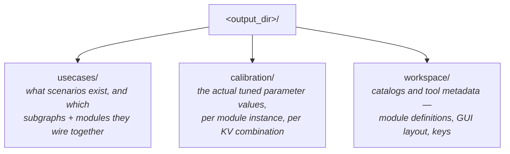
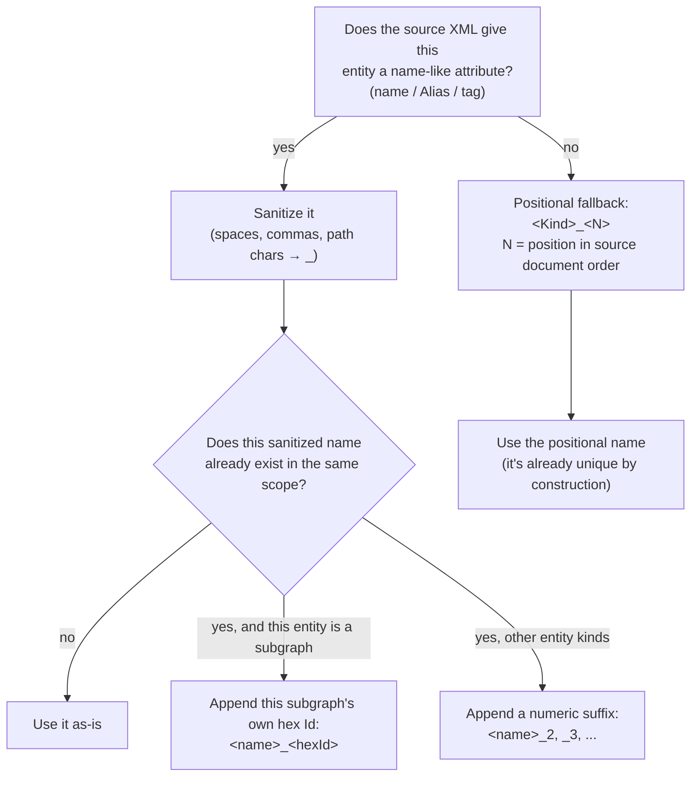
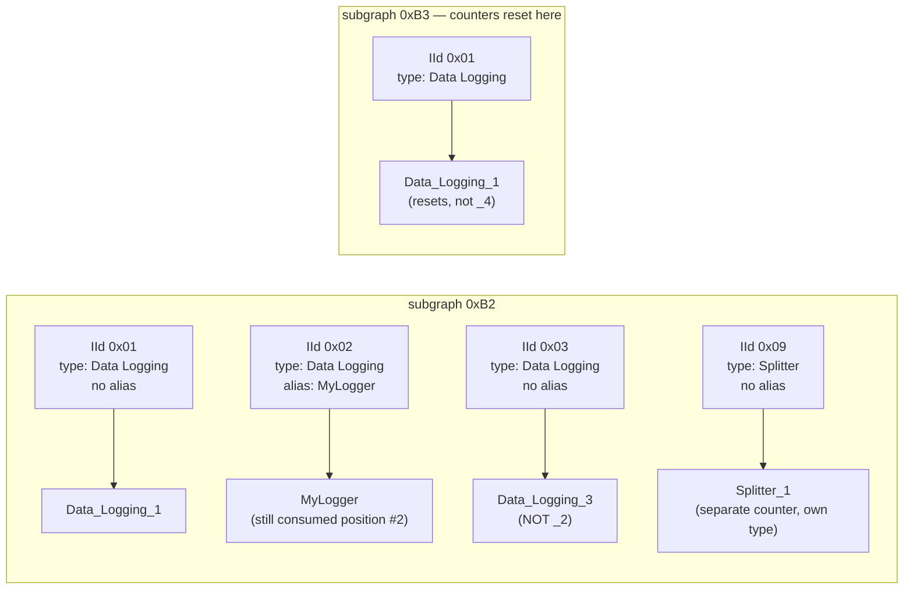
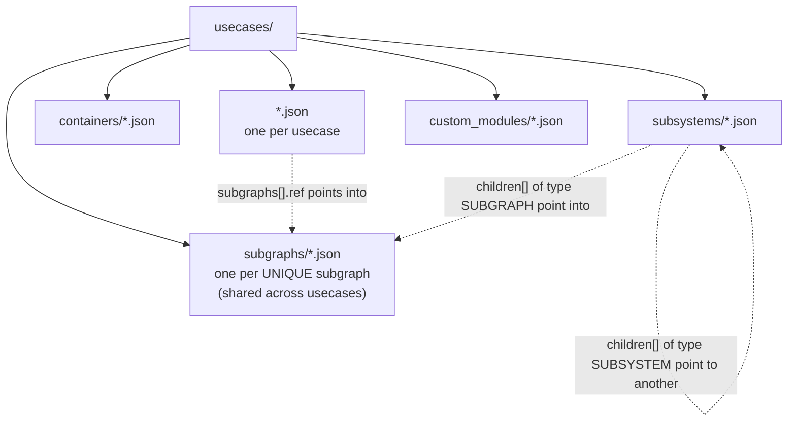
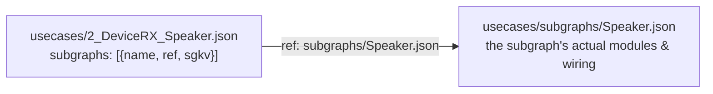
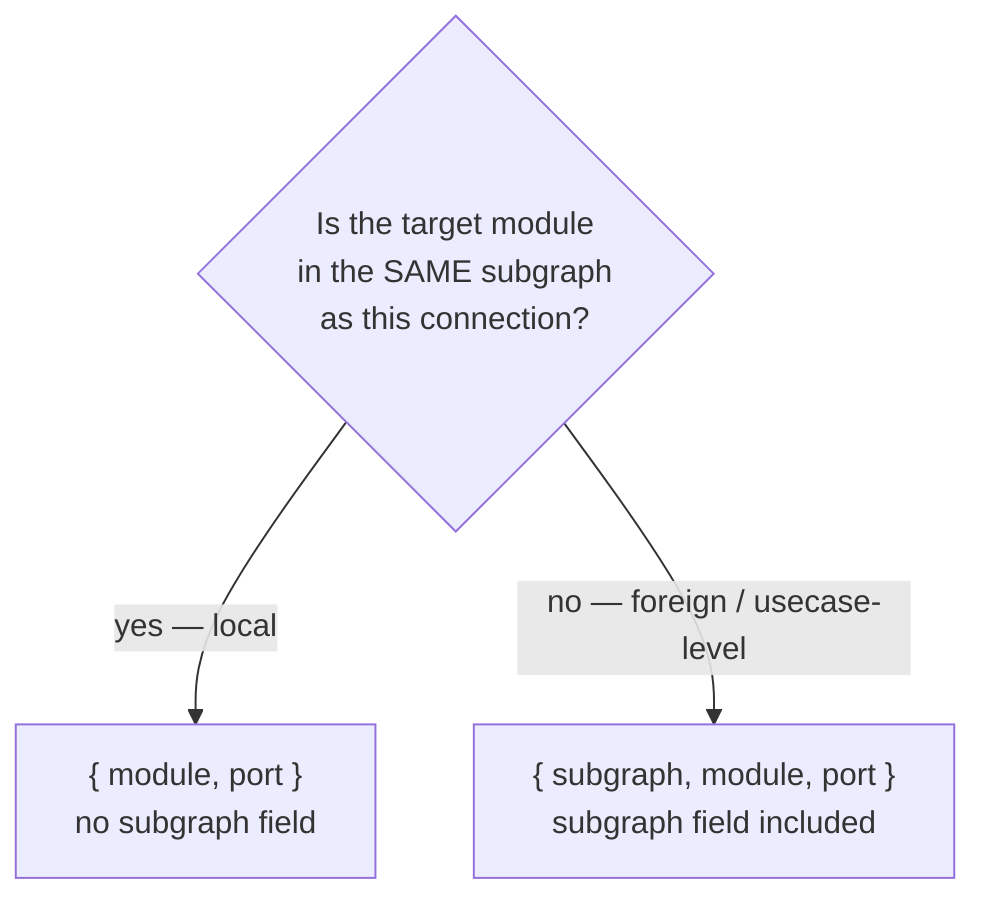
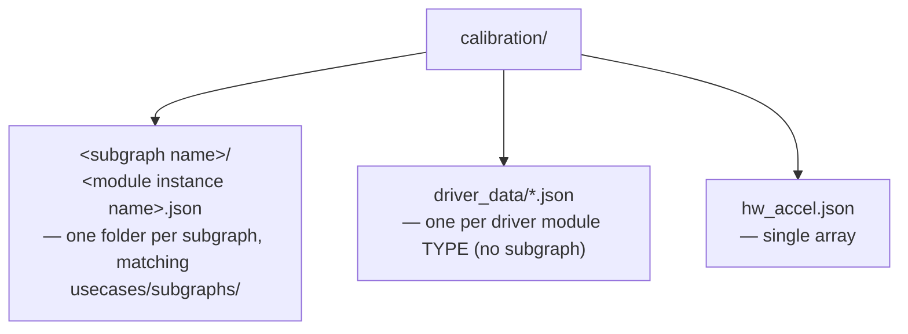
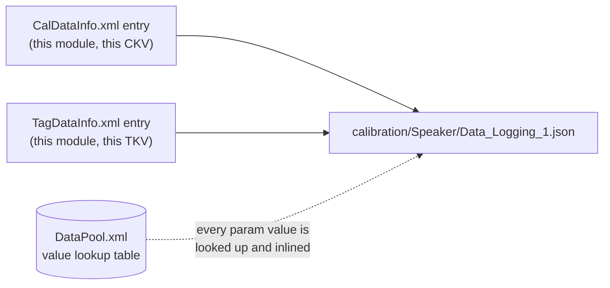
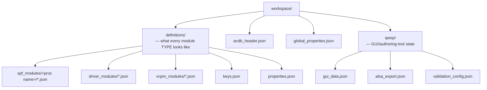
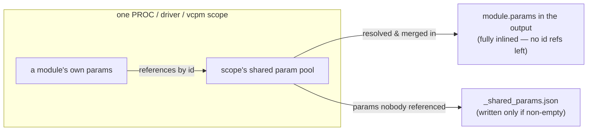

# JSON Output Format Guide

A field-by-field guide to the JSON tree this converter produces — for someone
**browsing or diffing the output**, not writing the converter. If you want to
know which *source XML* produced a given file, see `xml-to-json-mapping.md`.
If you want the formal rationale (FR-xx requirement IDs), see
`acdb-xml-to-json-requirements.md`.

---

## 1. The three top-level folders

Every conversion produces exactly one output directory containing three
folders:



A quick way to think about it: **`usecases/`** is the wiring diagram,
**`calibration/`** is the values plugged into that wiring, and
**`workspace/`** is everything else the authoring tool needs (schemas, GUI
state, validation config).

---

## 2. Reading a name vs. reading an ID

Almost every JSON object has both a human-readable `name` and a hex `id`.
**Always prefer the `name` for understanding; keep the `id` for cross-checking
against the original XML.** Names are deterministically generated — same
input always produces the same name — but they're derived, not authoritative;
the hex ID is the ground truth from the source ACDB tooling.

- If the source XML had a `name`/`Alias`/`tag` attribute, that's used
  (sanitized: spaces/commas/path characters → `_`).
- If not, a positional fallback is used: `Subgraph_<N>`, `Usecase_<N>`,
  `<ModuleName>_<N>` — where `<N>` is that entity's position in the original
  document order (so it's stable across re-runs, but tells you nothing about
  meaning).
- If two entities in the same folder would get the same name (confirmed to
  happen — e.g. five different subgraphs all literally named `Speaker`), the
  later ones get their hex ID appended: `Speaker`, `Speaker_0xB0000020`,
  `Speaker_0xB0000119`, …

The rest of this section works through that rule for each entity type.

---

## 3. How readable names are generated, entity by entity

Every entity below follows the same two-step shape: **(1)** try a
source-attribute name, sanitize it; **(2)** if that's absent, or collides with
one already used in the same scope, fall back deterministically. The
difference between entities is *which* source attribute, and *what scope*
collisions are checked within.



A key invariant across every case below: **the position counter always
advances**, whether or not the entity ended up with a real name. If the 2nd
of three subgraphs is named `Speaker`, the result is `Subgraph_1`, `Speaker`,
`Subgraph_3` — not `Subgraph_1`, `Speaker`, `Subgraph_2`. Named entities
"use up" their slot instead of being skipped over.

### 3.1 Module instances (`usecases/subgraphs/<subgraph>.json` → `modules[].name`)

Source: each `<Module>` inside a subgraph's `ModulesList`, with an `IId`
(instance id), an `MId` (module *type* id — resolved to a type name via
`workspace/definitions/`), and an optional `alias`.

- **Has `alias`?** → use it verbatim (sanitized). Nothing else about it changes.
- **No `alias`?** → `<ModuleTypeName>_<N>`, where `<N>` is a counter that is
  scoped **per subgraph, per module type** — it restarts at 1 for each
  distinct module type, and restarts again at every subgraph boundary.
- Aliased instances still **consume a position number** in that counter, even
  though the alias is what actually gets used.



| Source | Result |
|---|---|
| `<Module IId="0x01" ... name="Data Logging" />` (1st of type, no alias) | `Data_Logging_1` |
| `<Module IId="0x02" ... name="Data Logging" alias="MyLogger" />` (2nd of type) | `MyLogger` |
| `<Module IId="0x03" ... name="Data Logging" />` (3rd of type) | `Data_Logging_3` |
| Same module type, next subgraph over | counter restarts at `_1` |

### 3.2 Subgraphs (`usecases/subgraphs/<name>.json`, and every `subgraphs[].name` reference to it)

Source: each `<SubGraph>`'s optional `name` attribute, in `SubGraphsList`
document order.

- **Has `name`?** → use it (sanitized).
- **No `name` (empty string in real data)?** → `Subgraph_<N>`, `<N>` = this
  subgraph's position across the whole `SubGraphsList`.
- **Collision** (a different subgraph resolves to the same sanitized name —
  confirmed in real data, e.g. five distinct subgraphs literally named
  `Speaker`) → append **this subgraph's own hex `Id`**: the *first*
  occurrence keeps the bare name, every later one gets `_<hexId>` appended.
  This is the one entity type where the disambiguator is the hex ID, not a
  running counter — because the hex ID is already there and unambiguous.

| Source (in document order) | Result |
|---|---|
| `<SubGraph Id="0xB0000002" name="Speaker">` (1st `Speaker`) | `Speaker` |
| `<SubGraph Id="0xB0000020" name="Speaker">` (2nd `Speaker`) | `Speaker_0xB0000020` |
| `<SubGraph Id="0xB0000119" name="Speaker">` (3rd `Speaker`) | `Speaker_0xB0000119` |
| `<SubGraph Id="0xB2" name="">` (2nd subgraph overall, no name) | `Subgraph_2` |

This name is used identically in three places — as the folder-safe filename
(`usecases/subgraphs/<name>.json`), as the `name` field inside that file, and
as every usecase's `subgraphs[].name`/`.ref` pointing at it — so it can never
appear in two different spellings.

### 3.3 Containers (`usecases/containers/<name>.json`)

Source: `<Container Id="...">` — the schema has **no name attribute at all**
for containers.

- The hex `Id` **is** the name — used directly, unmodified, as both filename
  and `name` field. There is no `Container_<N>` positional fallback, because
  there's nothing to fall back *from*; the ID always exists.
- (An `alias`, if the source ever provided one, would still take precedence —
  but real container elements never carry one.)

| Source | Result |
|---|---|
| `<Container Id="0xE0000002">` | `0xE0000002` |

### 3.4 Usecase file names (`usecases/<name>.json`)

Source: each `<Usecase>`'s optional `Alias` attribute, in `UsecasesList`
document order.

- **Has `Alias`?** → use it (sanitized) — real aliases already look like
  `2_DeviceRX_Speaker` or `99_DeviceTX_Handset_Mic_DevicePP_Tx_...`, encoding
  a running number and the GKV, but that number comes from the *source* data,
  not from this converter.
- **No `Alias`?** → `Usecase_<N>`, `<N>` = this usecase's position across the
  whole `UsecasesList`.
- Collisions are handled the same way as any other filename-scope collision
  (§3.2's counter-suffix form), but not observed in real data — usecase
  aliases are unique in every real sample seen.

| Source | Result |
|---|---|
| `<Usecase Alias="2_DeviceRX_Speaker" ...>` (1st usecase) | `2_DeviceRX_Speaker.json` |
| `<Usecase ...>` with no `Alias` (2nd usecase) | `Usecase_2.json` |

### 3.5 Everything else, briefly

These follow the same pattern but are simple enough not to need their own
worked example:

| Entity | Name source | Fallback |
|---|---|---|
| Subsystems (`usecases/subsystems/<name>.json`) | `Name` attribute (always present in real data) | — |
| Custom modules (`usecases/custom_modules/<name>.json`) | `tag` → `fileName` → hex `Id` | first non-empty wins |
| SPF module definitions (`workspace/definitions/spf_modules/<proc>/<name>.json`) | `displayName` → code-constant `name` → hex `moduleId` | first present wins |
| Owning-PROC folder name (the `<proc>` in the path above) | `PLProcs` readable name (e.g. hex `0x2` → `ADSP`) | hex proc id |

---

## 4. `usecases/` — scenarios, subgraphs, and their wiring



### 4.1 A usecase file — `usecases/<usecase name>.json`

A usecase is one "scenario" (e.g. *"speaker playback"*, *"BT SCO call"*) —
identified by its `GKV` (Graph Key/Value string) — that wires together one or
more subgraphs.

```json
{
  "name": "2_DeviceRX_Speaker",
  "subgraphs": [
    { "name": "Speaker", "ref": "subgraphs/Speaker.json", "sgkv": "DeviceRX:Speaker" }
  ],
  "GKV": "DeviceRX:Speaker",
  "createMethod": "MANUAL",
  "PL": 1,
  "dataConnections": [],
  "ctrlConnections": []
}
```

| Field | Meaning |
|---|---|
| `subgraphs[]` | The subgraphs this usecase uses. **Not embedded** — each entry is a pointer (see below). |
| `subgraphs[].sgkv` | This subgraph's Key/Value string **as used by this specific usecase**. Important: the same subgraph can carry a *different* `sgkv` in a different usecase — it describes this (usecase, subgraph) pairing, not a fixed property of the subgraph itself. |
| `GKV` | This usecase's own Graph Key/Value string. |
| `dataConnections` / `ctrlConnections` | Links between modules that live in *different* subgraphs (cross-subgraph wiring). Each endpoint names both the `subgraph` and the `module`. |



**Why the pointer, not an inline copy:** many usecases reference the same
subgraph (e.g. `Speaker` might be used by a dozen different usecases). Each
usecase file stores only a `{name, ref, sgkv}` triple; the subgraph's actual
content — modules, connections, properties — is written exactly once, under
`usecases/subgraphs/`.

### 4.2 A subgraph file — `usecases/subgraphs/<subgraph name>.json`

```json
{
  "name": "Speaker",
  "id": "0xB0000002",
  "modules": [
    { "name": "Data_Logging_1", "moduleId": "0x0700101A" }
  ],
  "dataConnections": [],
  "ctrlConnections": [],
  "driverProperties": {},
  "spfProperties": {},
  "taggedModules": {}
}
```

| Field | Meaning |
|---|---|
| `modules[]` | Module instances in this subgraph. `name` is the per-subgraph, per-module-type readable name (`<ModuleName>_<N>` unless aliased); `moduleId` (`MId`) is the hex module-**type** ID — look this up in `workspace/definitions/` to see what the module actually does. |
| `dataConnections` / `ctrlConnections` | Wiring **within** this subgraph. Endpoints just say `module`+`port` (no `subgraph` field — it's implicit, they're all local). |
| `driverProperties` / `spfProperties` | Subgraph-level configuration, keyed by property name, values already decoded into plain JSON. |
| `taggedModules` | Named groups of modules within the subgraph (voice-tag groupings etc.), keyed by tag name. |

### 4.3 Endpoint naming rule — local vs. foreign

Connection endpoints follow one consistent rule everywhere in `usecases/`:



So inside a `subgraphs/<name>.json` file, endpoints are always local
(`{module, port}`). Inside a usecase's own `dataConnections`/
`ctrlConnections` (which necessarily span two subgraphs), and inside
`subsystems/*.json`, endpoints are always subgraph-qualified
(`{subgraph, module, port}`).

### 4.4 Containers, subsystems, custom modules

```json
// usecases/containers/0xE0000002.json
{ "name": "0xE0000002", "properties": { "Container Type": { "version": "0x00000001" } } }
```
Containers have no readable name in the source — the hex ID **is** the name.

```json
// usecases/subsystems/StreamRx_PCM_ULL.json
{
  "name": "StreamRx_PCM_ULL",
  "id": "0xF0100001",
  "children": [{ "name": "Speaker", "type": "SUBGRAPH" }],
  "dataPorts": [], "controlPorts": [],
  "dataConnections": [], "ctrlConnections": []
}
```
A subsystem groups subgraphs (and sometimes *other subsystems* —
`children[].type` is `"SUBGRAPH"` or `"SUBSYSTEM"`) under a hardware-routing
boundary.

```json
// usecases/custom_modules/capi_google_hw.json
{ "name": "capi_google_hw", "id": "0x18000001", "interfaceType": "2", "moduleType": "2" }
```

---

## 5. `calibration/` — tuned parameter values



The folder name under `calibration/` is **the same sanitized subgraph name**
used under `usecases/subgraphs/` — that's the cross-link between the two
trees; there's no separate ID field pointing back.

### 5.1 A module-instance calibration file

```json
// calibration/Speaker/Data_Logging_1.json
{
  "module": "Data_Logging_1",
  "moduleId": "0x0700101A",
  "calibration": [
    { "ckv": "", "params": { "PARAM_ID_GAIN": { "value": "0dB", "hex": "0x2000" } } }
  ],
  "tags": []
}
```

| Field | Meaning |
|---|---|
| `calibration[]` | One entry per **CKV** (Calibration Key/Value combination) this module instance has tuned values for. `params` is the fully decoded parameter payload — no lookup IDs left in the output. |
| `tags[]` | Same shape, keyed by **TKV** (Tag Key/Value) instead of CKV — a parallel, tag-scoped calibration source, merged into the same file per module instance. |



A payload value can appear as:
- a bare scalar: `"gain": "0dB"`
- a scalar plus its encoded hex/enum name: `{ "value": "0dB", "hex": "0x2000" }`
- an array (for `CONFIG_ELEMENT_ARRAY`): `["0x080010C2"]`
- a nested object (for `CONFIG_STRUCT`), or an array of nested objects (for
  `CONFIG_STRUCT_ARRAY`) — same recursive shape, just structured data instead
  of a scalar.

### 5.2 Driver data and hardware acceleration

```json
// calibration/driver_data/GSL_MULTI_DSP_FWK_DATA_MID.json
{ "module": "GSL_MULTI_DSP_FWK_DATA_MID", "moduleId": "0x00002005", "instances": [ { "kv": "...", "params": {} } ] }
```
Driver data is grouped by module **type** (`moduleId`), not by subgraph — a
driver module isn't tied to one subgraph the way calibration data is.

```json
// calibration/hw_accel.json
[ { "subgraph": "Speaker", "module": "Data_Logging_1", "paramIds": ["0x080013BC"] } ]
```
A single flat array (not one file per entry) of which parameters on which
module instance are hardware-accelerated.

---

## 6. `workspace/` — catalogs and tool metadata



**This is where you look up what a `moduleId` in `usecases/`/`calibration/`
actually *is*.** Everything under `usecases/`/`calibration/` refers to module
**instances**; `workspace/definitions/` describes module **types** — their
parameters, ports, and metadata.

### 6.1 Module definitions



```json
// workspace/definitions/spf_modules/ADSP/Data_Logging.json
{
  "name": "Data_Logging", "moduleId": "0x0700101A",
  "displayName": "Data Logging", "description": "...",
  "rtView": [], "dataView": [],
  "moduleInfo": { "dataPortInfo": { "inputPorts": {...}, "outputPorts": {...} }, "contTypes": [] },
  "params": [ { "id": "0x...", "name": "...", "configElements": [...] } ],
  "structs": []
}
```

- **`spf_modules/<proc name>/`** — grouped by owning processor (e.g. `ADSP`,
  `cDSP` — resolved from the processor's readable name, falling back to its
  hex ID).
- **`driver_modules/`** and **`vcpm_modules/`** — flat, no processor grouping.
- `params[]` is **fully resolved**: a module's own parameters plus any
  parameters it references from that scope's shared pool, merged into one
  list. The output never shows a bare parameter-id reference.
- `keys.json` — the catalog of all Key/Value **key** names (the vocabulary
  that `GKV`/`SGKV`/`CKV`/`TKV` strings are built from) and their valid value
  indices.
- `properties.json` — the catalog of subgraph-level property definitions
  (`driverProperties`/`spfProperties` in `usecases/subgraphs/*.json` are
  *instances* of properties defined here).

### 6.2 `qwsp/` — authoring-tool state

This is GUI/workflow state from the authoring tool, not audio configuration —
useful for understanding tool history, not runtime behavior.

- `gui_data.json` — canvas layout (where boxes are positioned on screen),
  merge/review history (which GKVs were reviewed and by whom), and dereferenced
  calibration-view blobs.
- `alsa_export.json` — ALSA property-group export config.
- `validation_config.json` — which validators were enabled/ignored when this
  file was authored.

---

## 7. Cross-reference cheat sheet

| You have... | ...and want to find | Go to |
|---|---|---|
| A usecase name | Its subgraphs | `usecases/<name>.json` → `subgraphs[].ref` |
| A subgraph name | Its modules and wiring | `usecases/subgraphs/<name>.json` |
| A subgraph name | Its tuned parameter values | `calibration/<name>/` (same sanitized name) |
| A module instance name (in a subgraph) | Its type's parameter schema | `modules[].moduleId` in the subgraph file → search `workspace/definitions/*/**.json` for that `moduleId` |
| A `GKV`/`SGKV`/`CKV`/`TKV` string | What the key names mean | `workspace/definitions/keys.json` |
| A hex ID anywhere | The original XML element | grep the hex ID directly — it's preserved verbatim everywhere (never renamed or recomputed) |

---

## 8. What's deliberately *not* in the output

- **Checksums** (on subgraphs, usecases, etc.) — recomputed by tooling, not
  meaningful to a human reader.
- **`AutoGeneratedIDs` / `XML2ACDB`** — ID-allocation bookkeeping
  (`LastUsedId`/`MaxId`/timestamps) from the authoring tool, not audio data.
- **Raw lookup IDs** (`payloadId`, `Unique_Data_Guid`, PARAM_LIST shared-pool
  references) — every one of these is resolved and inlined during
  conversion; if you see one of these key names in the output, that's a bug.
